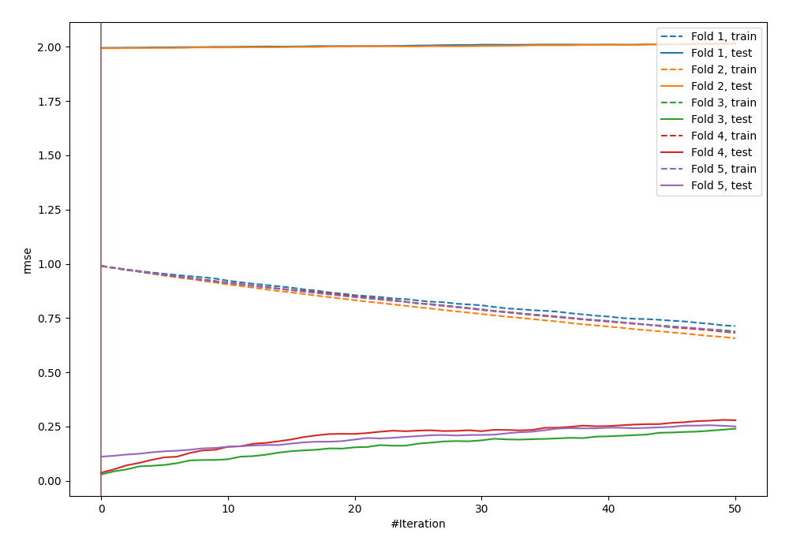
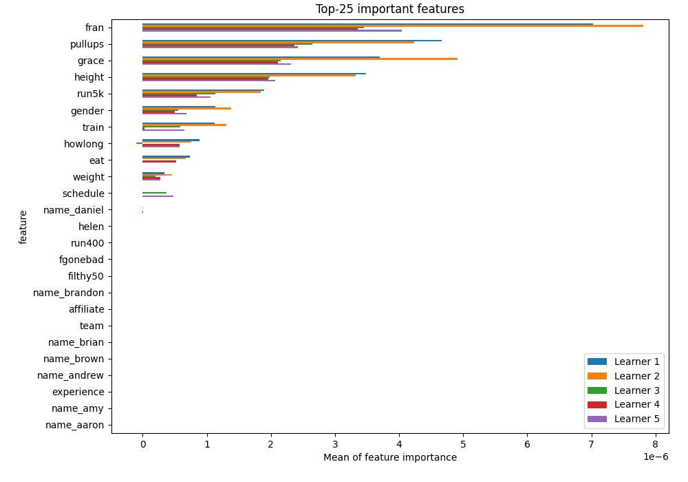
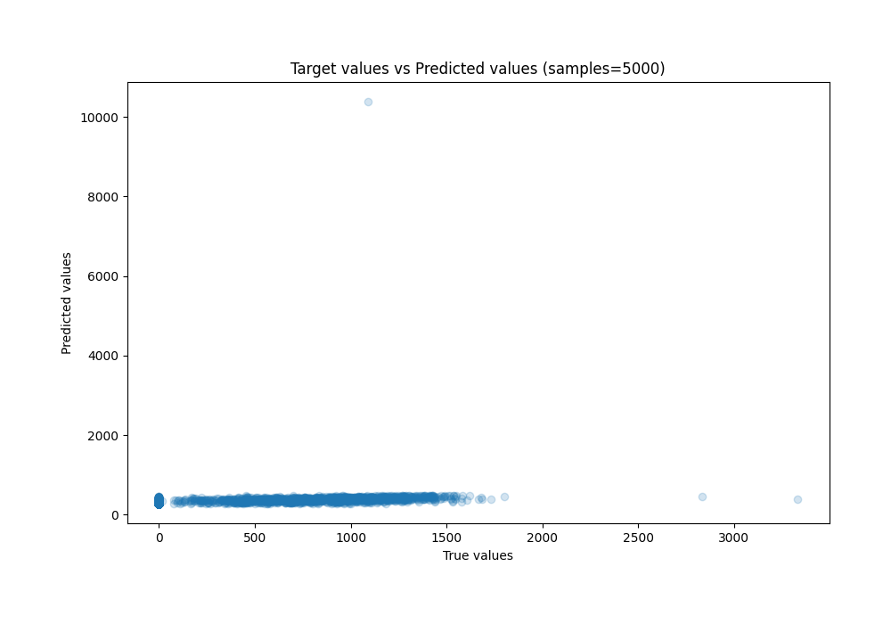
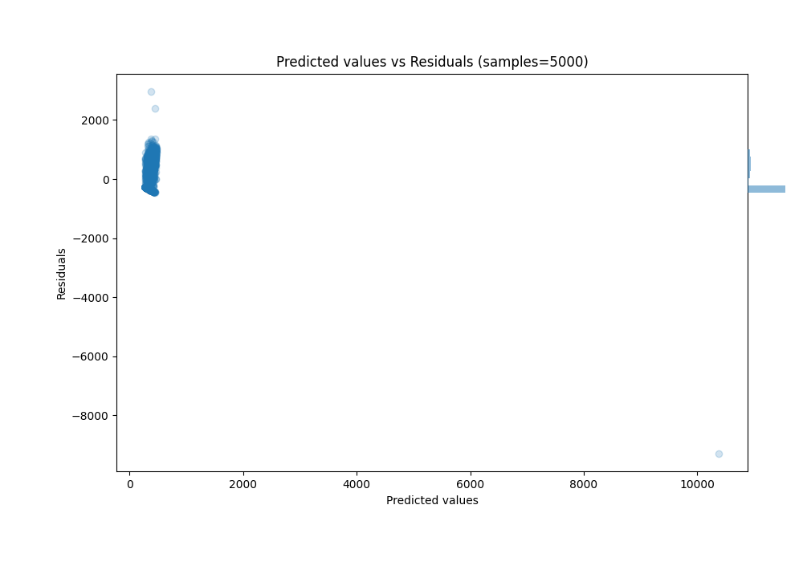

# Summary of 10_LightGBM

[<< Go back](../README.md)

## LightGBM
- **n_jobs**: -1
- **objective**: regression
- **num_leaves**: 63
- **learning_rate**: 0.1
- **feature_fraction**: 0.9
- **bagging_fraction**: 0.9
- **min_data_in_leaf**: 10
- **metric**: rmse
- **custom_eval_metric_name**: None
- **explain_level**: 1

## Validation
 - **validation_type**: kfold
 - **k_folds**: 5
 - **shuffle**: True

## Optimized metric
rmse

## Training time

78.3 seconds

### Metric details:
| Metric   |           Score |
|:---------|----------------:|
| MAE      |   483.97        |
| MSE      |     1.67103e+09 |
| RMSE     | 40878.2         |
| R2       |    -0.000887272 |
| MAPE     |     1.03384e+18 |

## Learning curves

## Permutation-based Importance

## True vs Predicted

## Predicted vs Residuals

[<< Go back](../README.md)
