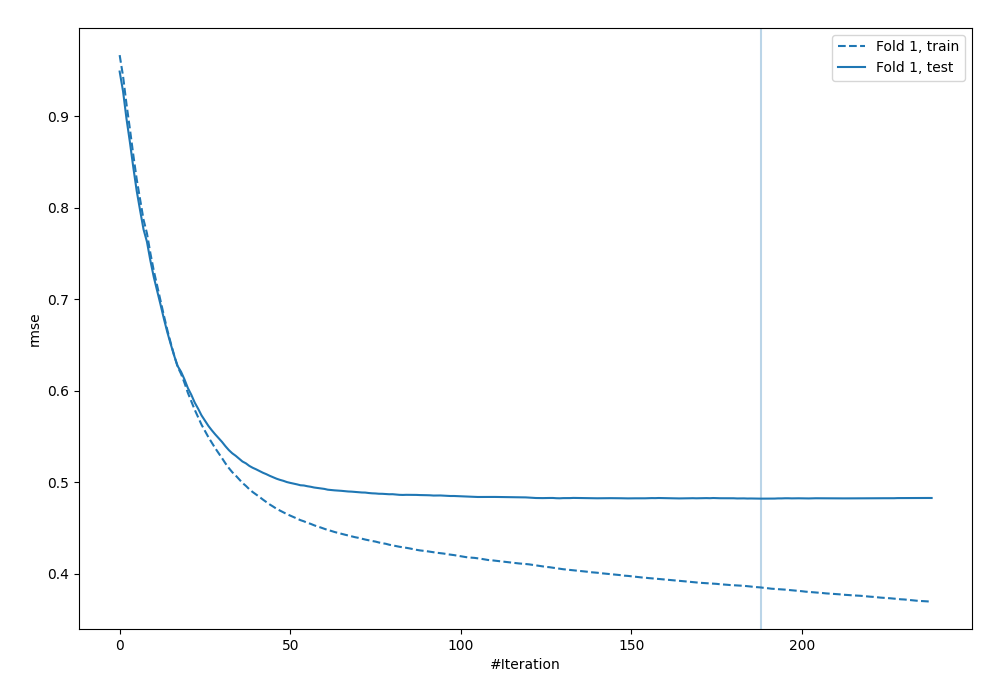
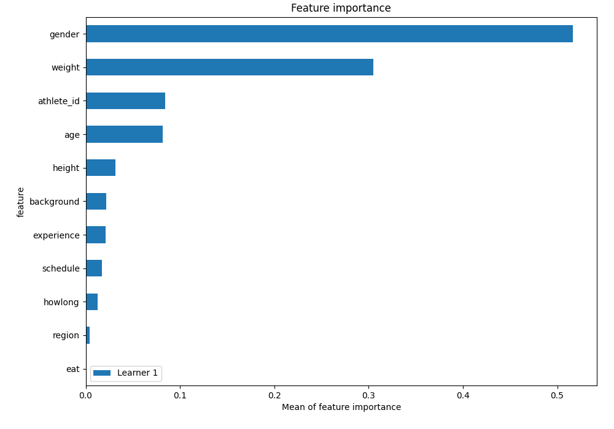
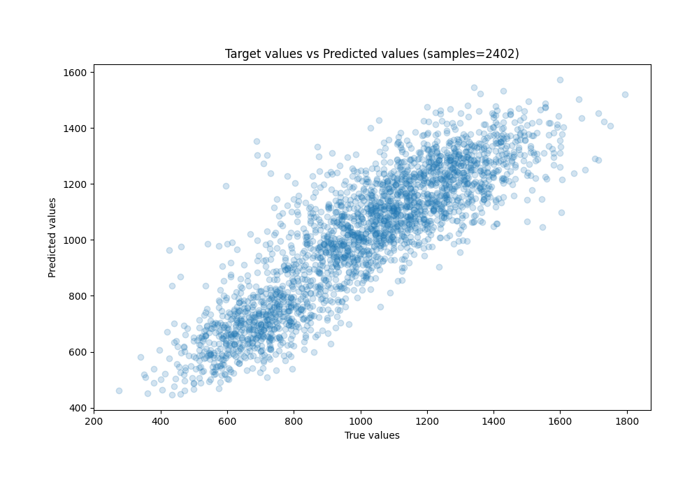
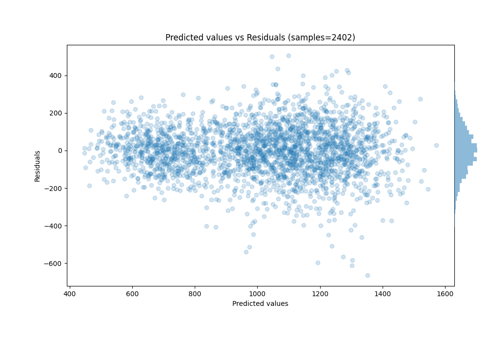

# Summary of 16_Xgboost

[<< Go back](../README.md)

## Extreme Gradient Boosting (Xgboost)
- **n_jobs**: -1
- **objective**: reg:squarederror
- **eta**: 0.05
- **max_depth**: 8
- **min_child_weight**: 5
- **subsample**: 0.5
- **colsample_bytree**: 0.8
- **eval_metric**: rmse
- **explain_level**: 1

## Validation
 - **validation_type**: split
 - **train_ratio**: 0.9
 - **shuffle**: True

## Optimized metric
rmse

## Training time

1.3 seconds

### Metric details:
| Metric   |        Score |
|:---------|-------------:|
| MAE      |   102.577    |
| MSE      | 17935.9      |
| RMSE     |   133.925    |
| R2       |     0.758159 |
| MAPE     |     0.109818 |

## Learning curves

## Permutation-based Importance

## True vs Predicted

## Predicted vs Residuals

[<< Go back](../README.md)
