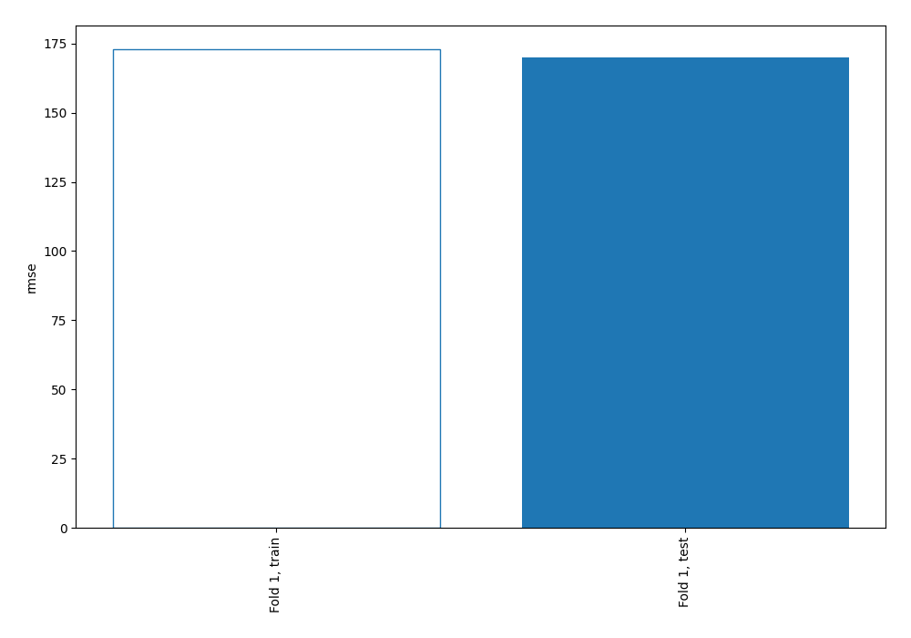
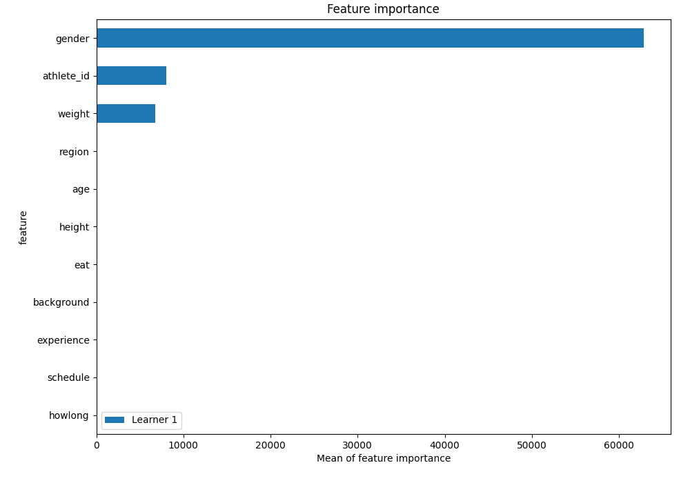
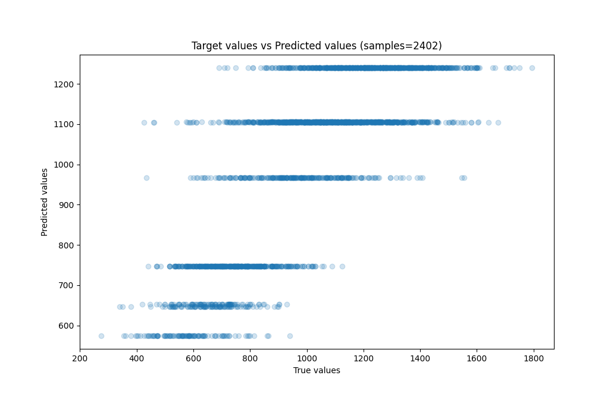

# Summary of 1_DecisionTree

[<< Go back](../README.md)

## Decision Tree
- **n_jobs**: -1
- **criterion**: squared_error
- **max_depth**: 3
- **explain_level**: 1

## Validation
 - **validation_type**: split
 - **train_ratio**: 0.9
 - **shuffle**: True

## Optimized metric
rmse

## Training time

4.1 seconds

### Metric details:
| Metric   |        Score |
|:---------|-------------:|
| MAE      |   132.272    |
| MSE      | 28888.9      |
| RMSE     |   169.967    |
| R2       |     0.610472 |
| MAPE     |     0.141485 |

## Learning curves

## Permutation-based Importance

## True vs Predicted

## Predicted vs Residuals

[<< Go back](../README.md)
