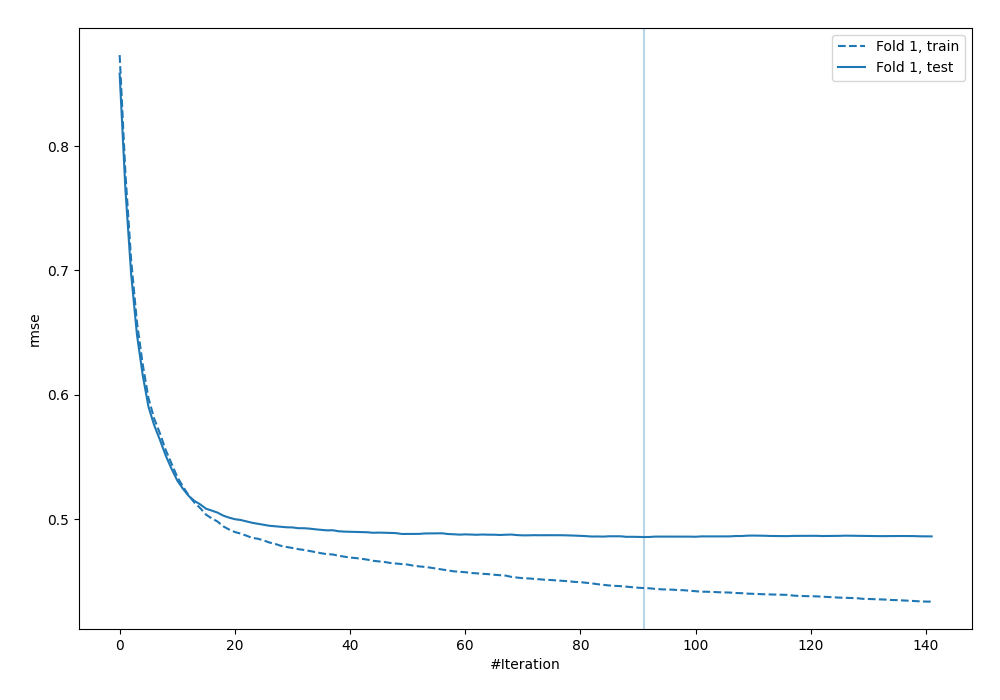
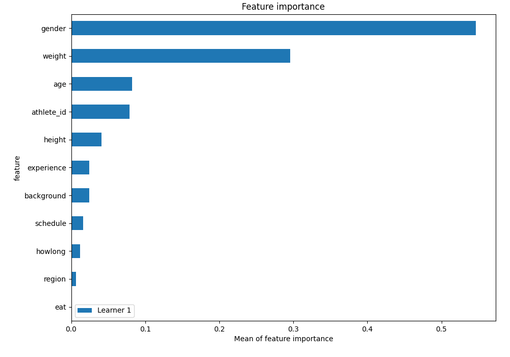
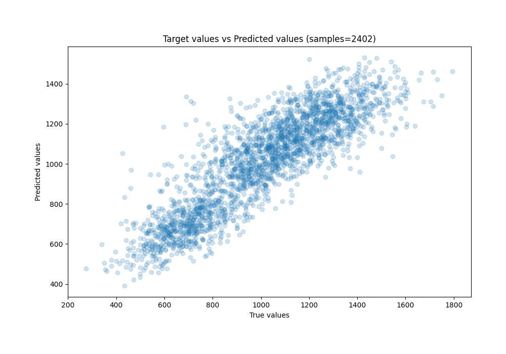
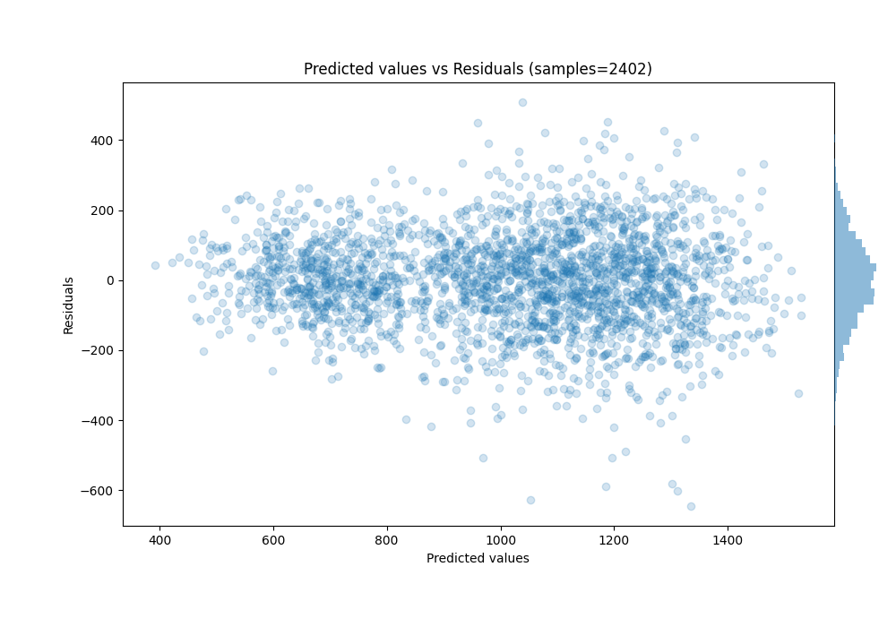

# Summary of 31_CatBoost

[<< Go back](../README.md)

## CatBoost
- **n_jobs**: -1
- **learning_rate**: 0.2
- **depth**: 8
- **rsm**: 1.0
- **loss_function**: MAE
- **eval_metric**: RMSE
- **explain_level**: 1

## Validation
 - **validation_type**: split
 - **train_ratio**: 0.9
 - **shuffle**: True

## Optimized metric
rmse

## Training time

1.7 seconds

### Metric details:
| Metric   |        Score |
|:---------|-------------:|
| MAE      |   103.969    |
| MSE      | 18200.1      |
| RMSE     |   134.908    |
| R2       |     0.754597 |
| MAPE     |     0.111149 |

## Learning curves

## Permutation-based Importance

## True vs Predicted

## Predicted vs Residuals

[<< Go back](../README.md)
