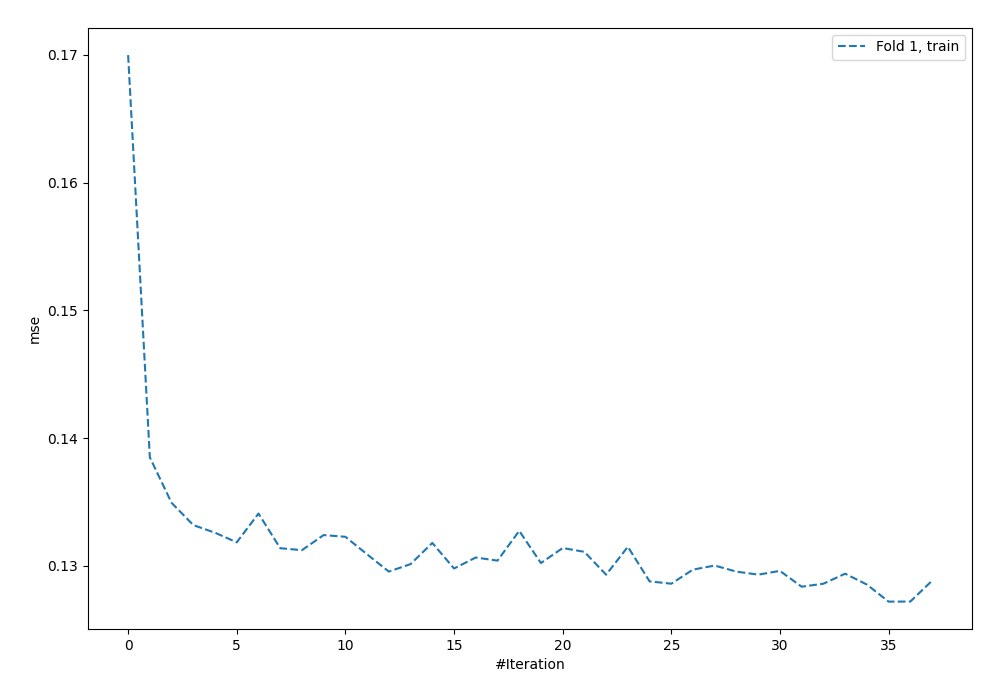
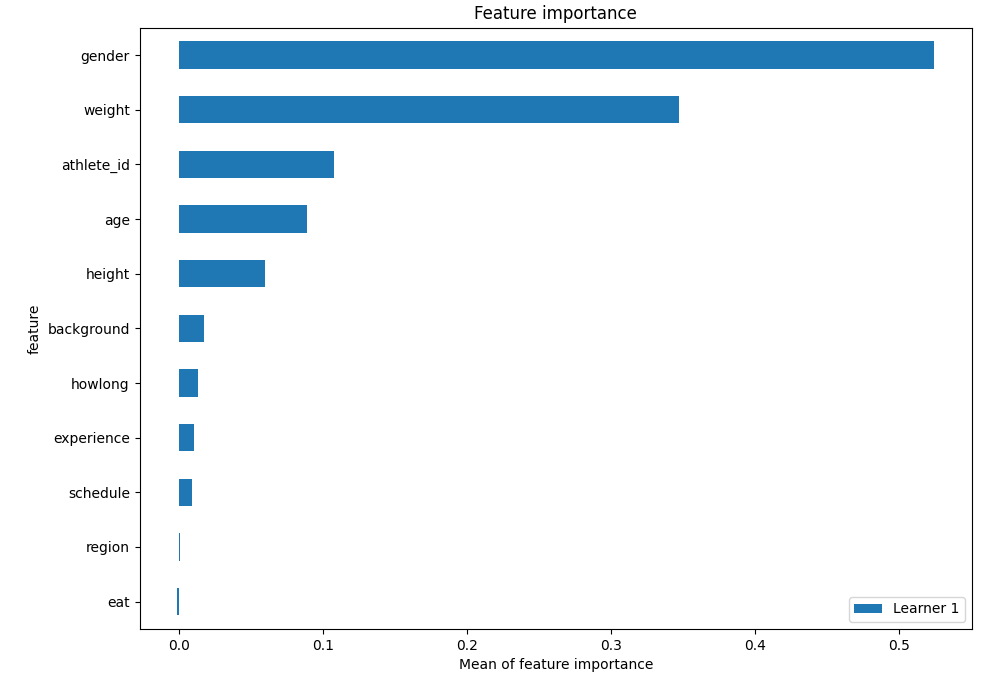
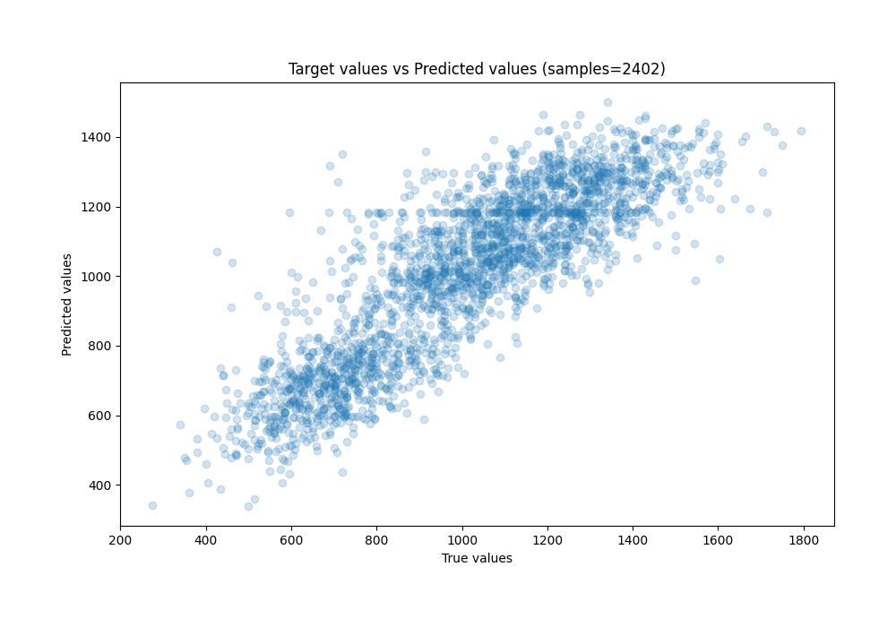
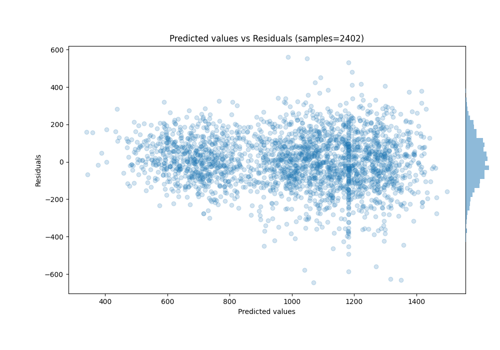

# Summary of 81_NeuralNetwork

[<< Go back](../README.md)

## Neural Network
- **n_jobs**: -1
- **dense_1_size**: 32
- **dense_2_size**: 8
- **learning_rate**: 0.05
- **explain_level**: 1

## Validation
 - **validation_type**: split
 - **train_ratio**: 0.9
 - **shuffle**: True

## Optimized metric
rmse

## Training time

1.9 seconds

### Metric details:
| Metric   |        Score |
|:---------|-------------:|
| MAE      |   109.614    |
| MSE      | 19974.1      |
| RMSE     |   141.33     |
| R2       |     0.730677 |
| MAPE     |     0.116785 |

## Learning curves

## Permutation-based Importance

## True vs Predicted

## Predicted vs Residuals

[<< Go back](../README.md)
