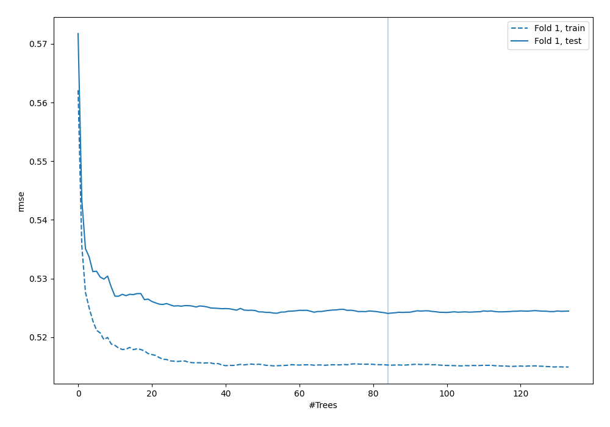
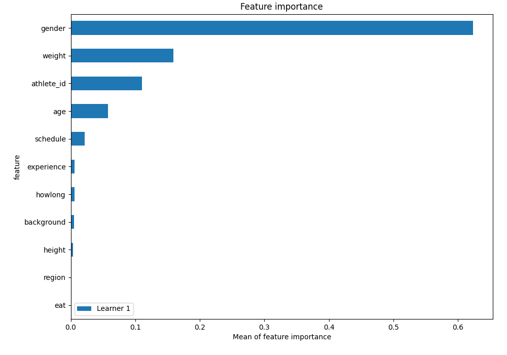
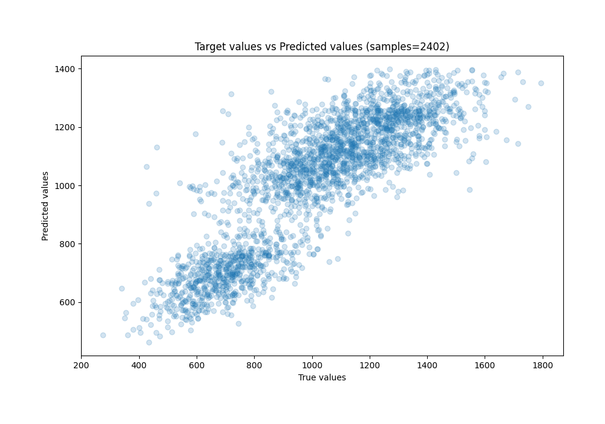
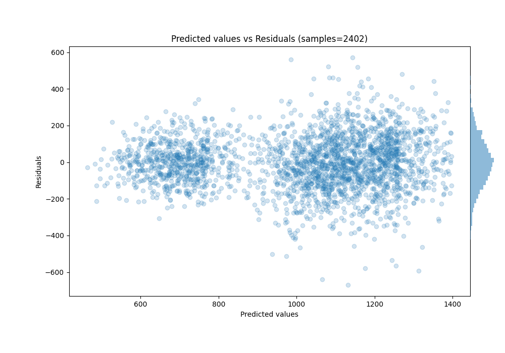

# Summary of 84_RandomForest

[<< Go back](../README.md)

## Random Forest
- **n_jobs**: -1
- **criterion**: squared_error
- **max_features**: 0.6
- **min_samples_split**: 30
- **max_depth**: 7
- **eval_metric_name**: rmse
- **explain_level**: 1

## Validation
 - **validation_type**: split
 - **train_ratio**: 0.9
 - **shuffle**: True

## Optimized metric
rmse

## Training time

3.2 seconds

### Metric details:
| Metric   |        Score |
|:---------|-------------:|
| MAE      |   112.047    |
| MSE      | 21189.1      |
| RMSE     |   145.565    |
| R2       |     0.714294 |
| MAPE     |     0.119924 |

## Learning curves

## Permutation-based Importance

## True vs Predicted

## Predicted vs Residuals

[<< Go back](../README.md)
