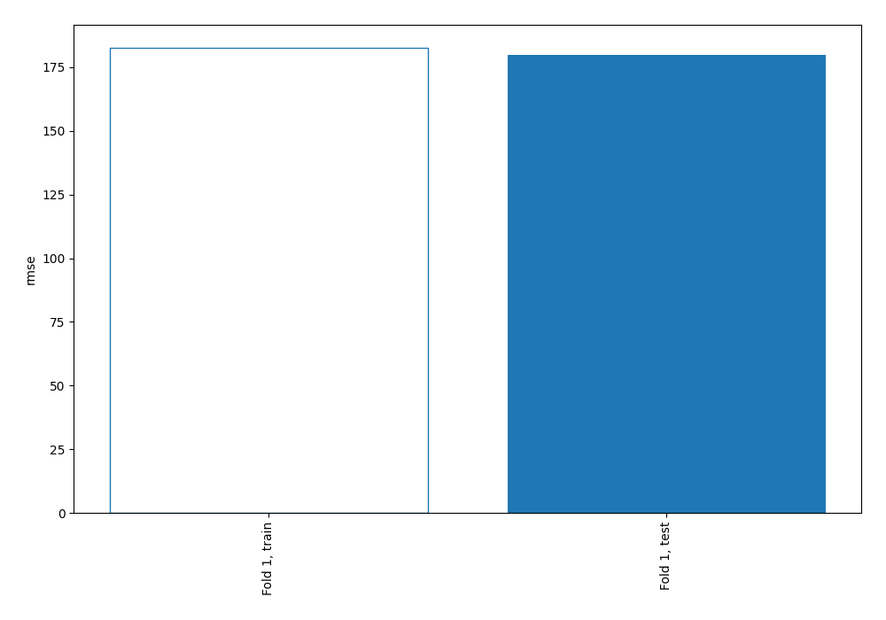
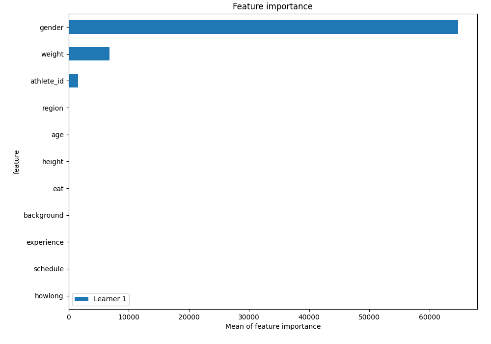
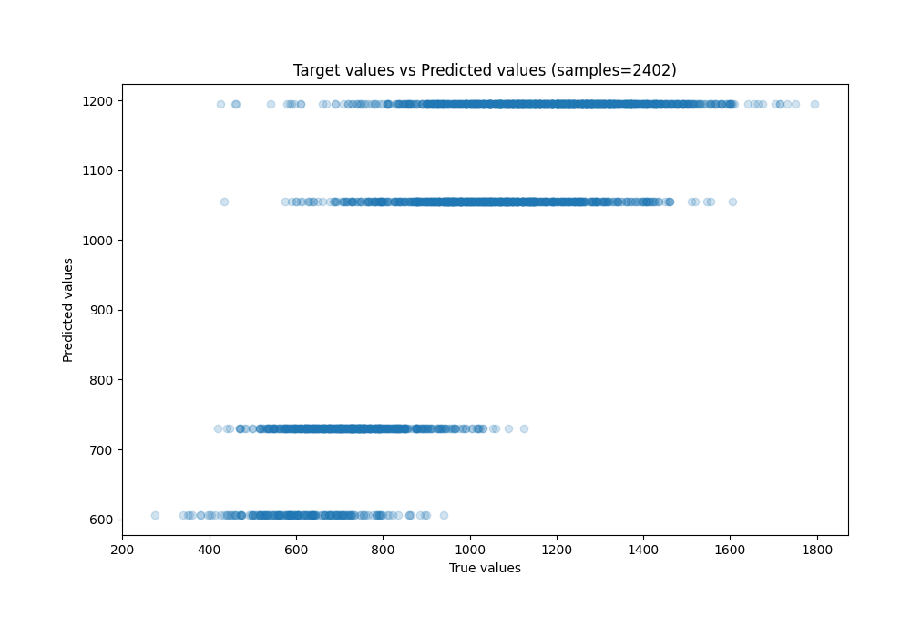
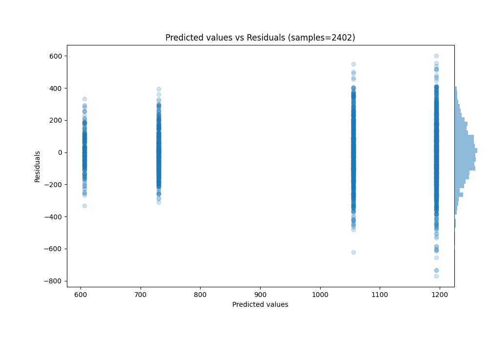

# Summary of 89_DecisionTree

[<< Go back](../README.md)

## Decision Tree
- **n_jobs**: -1
- **criterion**: squared_error
- **max_depth**: 2
- **explain_level**: 1

## Validation
 - **validation_type**: split
 - **train_ratio**: 0.9
 - **shuffle**: True

## Optimized metric
rmse

## Training time

0.7 seconds

### Metric details:
| Metric   |        Score |
|:---------|-------------:|
| MAE      |   140.194    |
| MSE      | 32317.5      |
| RMSE     |   179.771    |
| R2       |     0.564243 |
| MAPE     |     0.150661 |

## Learning curves

## Permutation-based Importance

## True vs Predicted

## Predicted vs Residuals

[<< Go back](../README.md)
