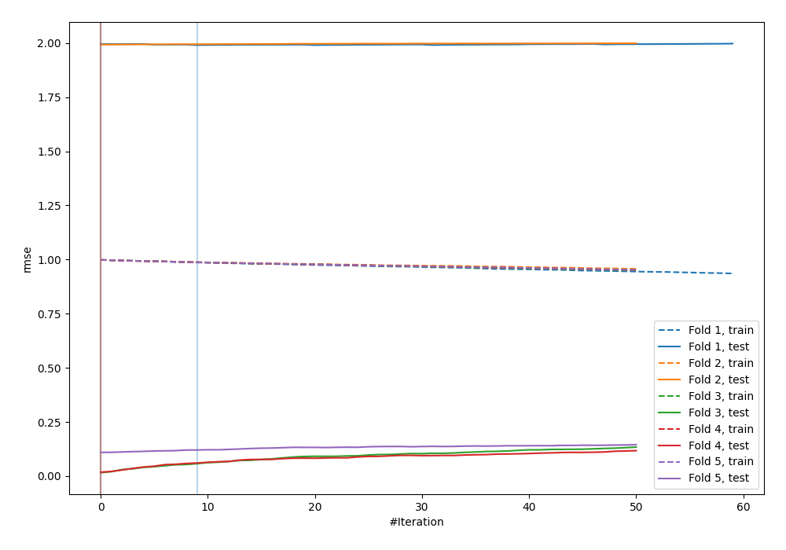
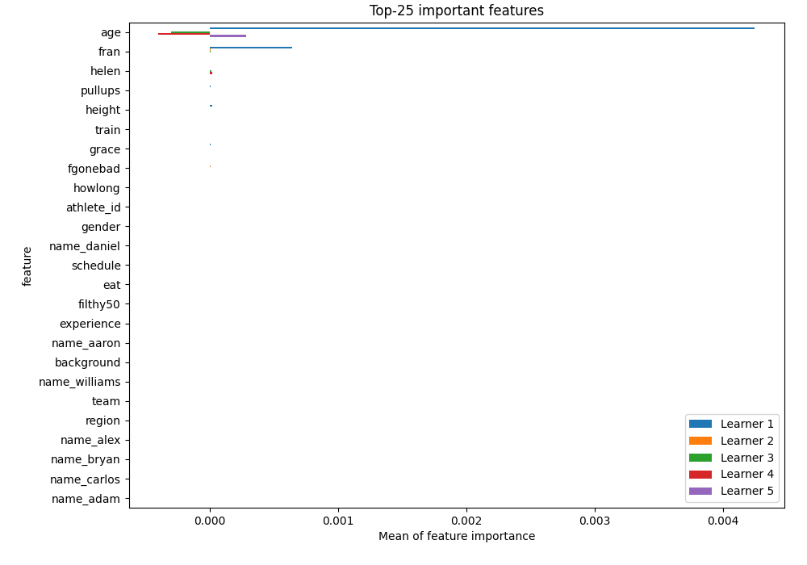
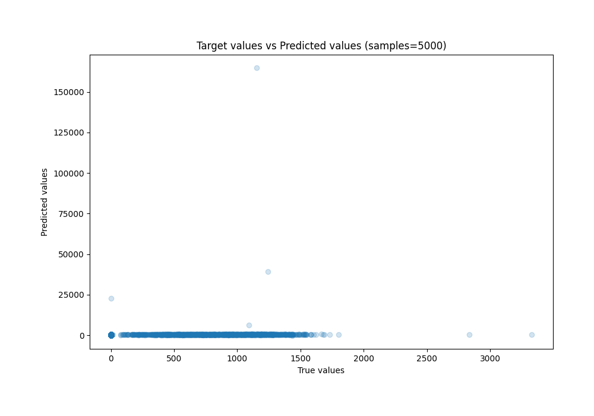
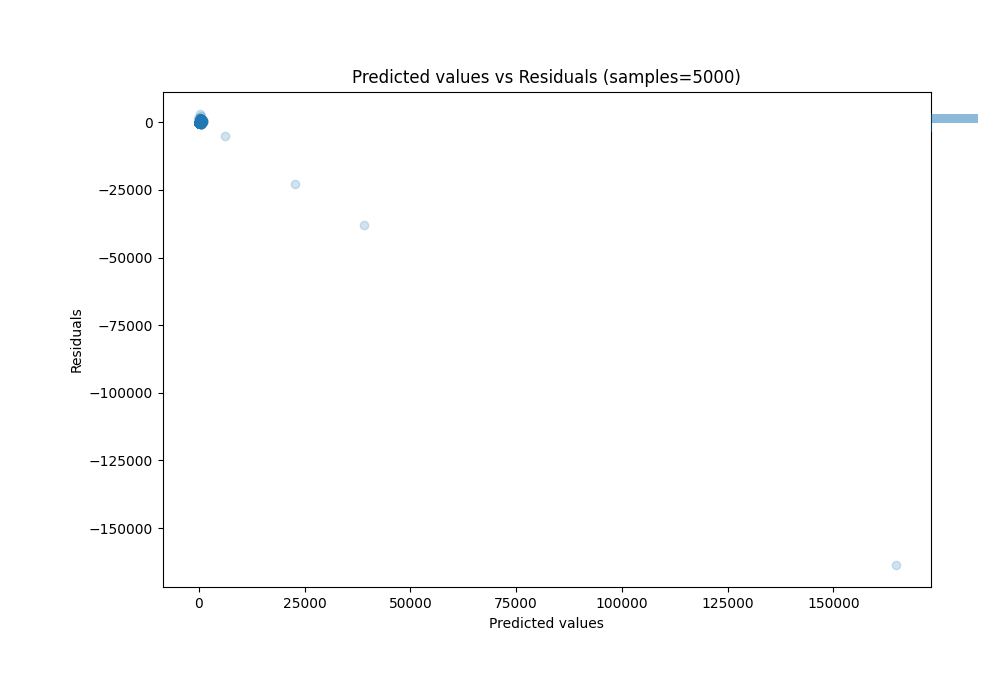

# Summary of 9_LightGBM

[<< Go back](../README.md)

## LightGBM
- **n_jobs**: -1
- **objective**: regression
- **num_leaves**: 15
- **learning_rate**: 0.1
- **feature_fraction**: 0.8
- **bagging_fraction**: 0.5
- **min_data_in_leaf**: 50
- **metric**: rmse
- **custom_eval_metric_name**: None
- **explain_level**: 1

## Validation
 - **validation_type**: kfold
 - **k_folds**: 5
 - **shuffle**: True

## Optimized metric
rmse

## Training time

76.0 seconds

### Metric details:
| Metric   |           Score |
|:---------|----------------:|
| MAE      |   473.944       |
| MSE      |     1.66593e+09 |
| RMSE     | 40815.8         |
| R2       |     0.00216926  |
| MAPE     |     9.69709e+17 |

## Learning curves

## Permutation-based Importance

## True vs Predicted

## Predicted vs Residuals

[<< Go back](../README.md)
