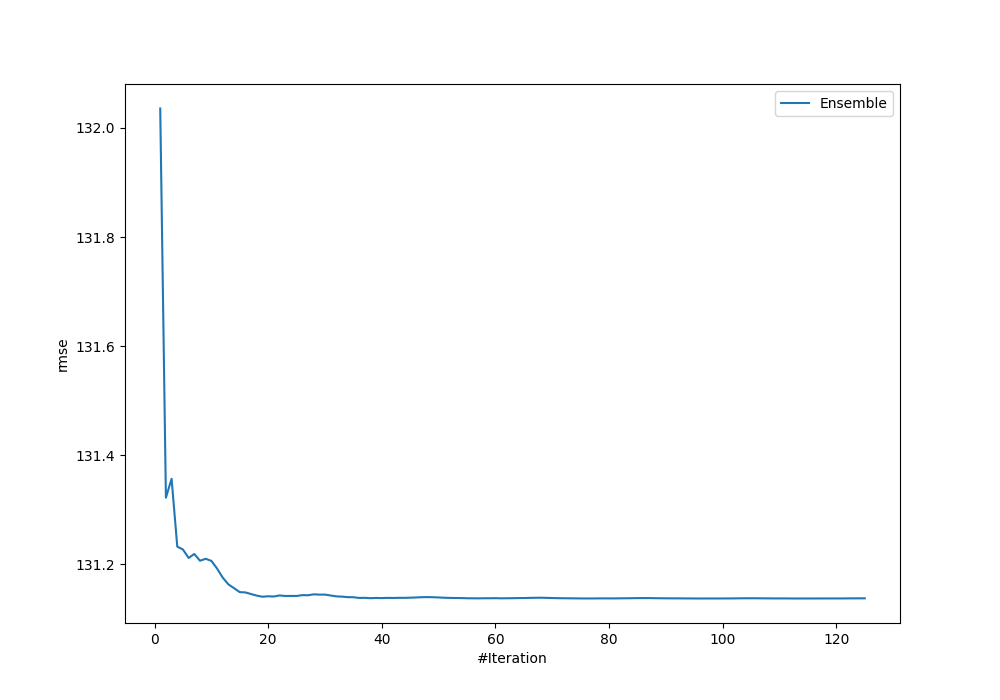
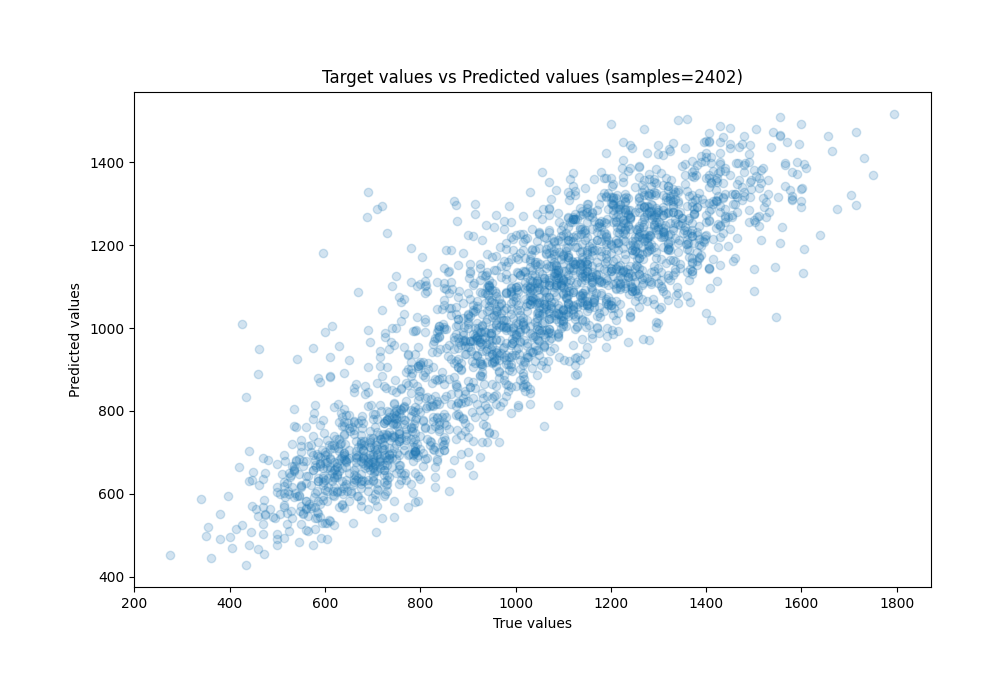
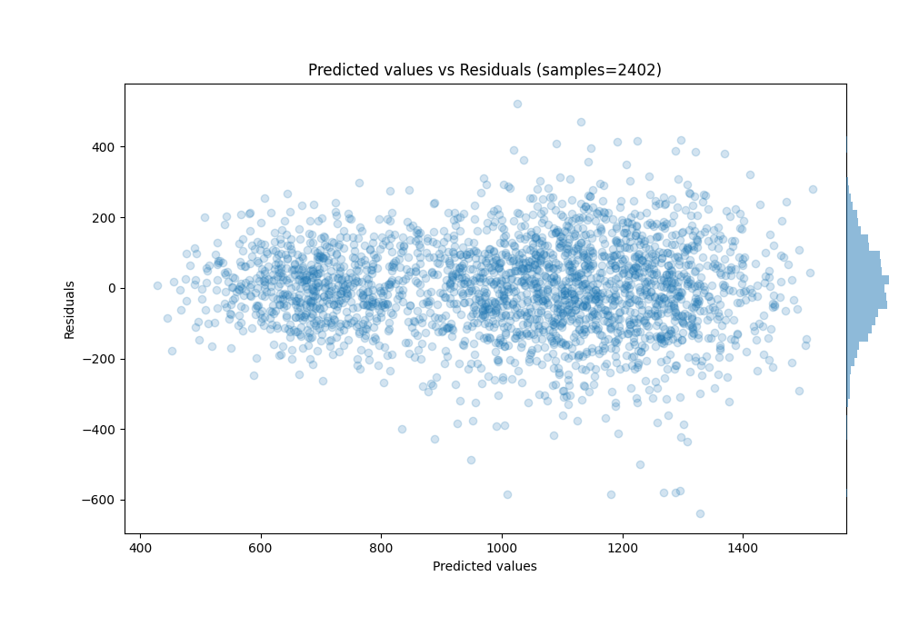

# Summary of Ensemble

[<< Go back](../README.md)

## Ensemble structure
| Model      |   Weight |
|:-----------|---------:|
| 8_LightGBM |        1 |

### Metric details:
| Metric   |           Score |
|:---------|----------------:|
| MAE      |   479.436       |
| MSE      |     1.66501e+09 |
| RMSE     | 40804.5         |
| R2       |     0.00271931  |
| MAPE     |     9.7928e+17  |

## Learning curves

## True vs Predicted

## Predicted vs Residuals

[<< Go back](../README.md)
