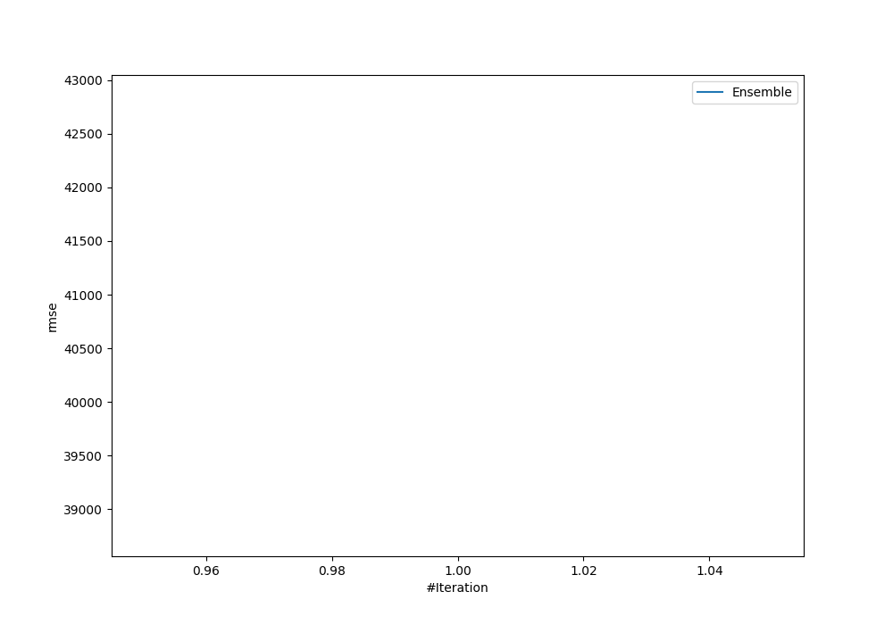

# Summary of Ensemble

[<< Go back](../README.md)

## Ensemble structure
| Model                             |   Weight |
|:----------------------------------|---------:|
| 11_Xgboost                        |       15 |
| 18_Xgboost                        |        4 |
| 28_CatBoost                       |        2 |
| 62_NeuralNetwork                  |        5 |
| 65_CatBoost_GoldenFeatures        |       32 |
| 6_Default_CatBoost_GoldenFeatures |       11 |
| 78_LightGBM                       |        1 |
| 90_CatBoost_GoldenFeatures        |        1 |
| 96_LightGBM                       |        3 |
| 97_Xgboost_SelectedFeatures       |       22 |

### Metric details:
| Metric   |        Score |
|:---------|-------------:|
| MAE      |   101.063    |
| MSE      | 17197        |
| RMSE     |   131.137    |
| R2       |     0.768122 |
| MAPE     |     0.1081   |

## Learning curves

## True vs Predicted

## Predicted vs Residuals

[<< Go back](../README.md)
