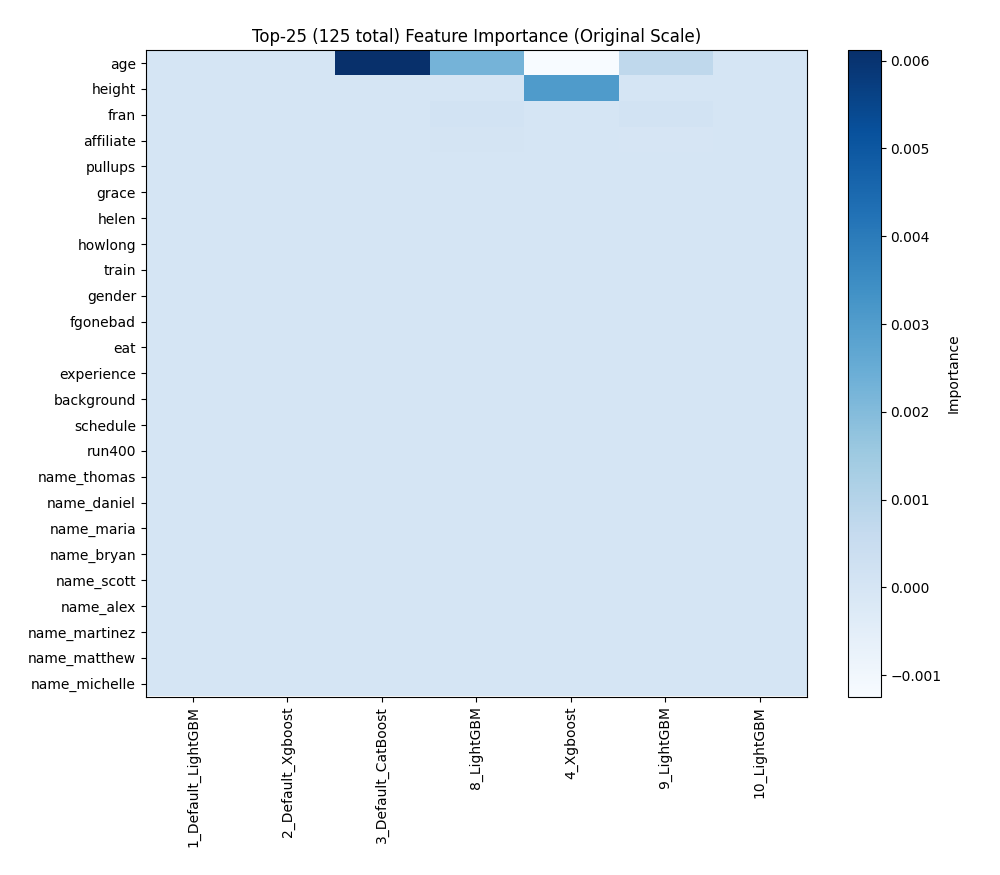

# AutoML Leaderboard

| Best model   | name                                                                                                 | model_type     | metric_type   |   metric_value |   train_time |
|:-------------|:-----------------------------------------------------------------------------------------------------|:---------------|:--------------|---------------:|-------------:|
|              | [1_DecisionTree](1_DecisionTree/README.md)                                                           | Decision Tree  | rmse          |        169.967 |         4.43 |
|              | [2_DecisionTree](2_DecisionTree/README.md)                                                           | Decision Tree  | rmse          |        164.17  |         0.76 |
|              | [3_DecisionTree](3_DecisionTree/README.md)                                                           | Decision Tree  | rmse          |        164.17  |         0.96 |
|              | [4_Default_LightGBM](4_Default_LightGBM/README.md)                                                   | LightGBM       | rmse          |        133.742 |         2.44 |
|              | [5_Default_Xgboost](5_Default_Xgboost/README.md)                                                     | Xgboost        | rmse          |        133.16  |         1.11 |
|              | [6_Default_CatBoost](6_Default_CatBoost/README.md)                                                   | CatBoost       | rmse          |        132.584 |         3.23 |
|              | [7_Default_NeuralNetwork](7_Default_NeuralNetwork/README.md)                                         | Neural Network | rmse          |        140.133 |         1.41 |
|              | [8_Default_RandomForest](8_Default_RandomForest/README.md)                                           | Random Forest  | rmse          |        157.62  |         4.9  |
|              | [9_Default_ExtraTrees](9_Default_ExtraTrees/README.md)                                               | Extra Trees    | rmse          |        164.776 |         2.64 |
|              | [19_LightGBM](19_LightGBM/README.md)                                                                 | LightGBM       | rmse          |        133.272 |         2.34 |
|              | [10_Xgboost](10_Xgboost/README.md)                                                                   | Xgboost        | rmse          |        133.722 |         1.26 |
|              | [28_CatBoost](28_CatBoost/README.md)                                                                 | CatBoost       | rmse          |        132.294 |         5.98 |
|              | [37_RandomForest](37_RandomForest/README.md)                                                         | Random Forest  | rmse          |        158.169 |         3.88 |
|              | [46_ExtraTrees](46_ExtraTrees/README.md)                                                             | Extra Trees    | rmse          |        167.4   |         2.15 |
|              | [55_NeuralNetwork](55_NeuralNetwork/README.md)                                                       | Neural Network | rmse          |        142.123 |         1.71 |
|              | [20_LightGBM](20_LightGBM/README.md)                                                                 | LightGBM       | rmse          |        135.143 |         1.33 |
|              | [11_Xgboost](11_Xgboost/README.md)                                                                   | Xgboost        | rmse          |        133.62  |         1.25 |
|              | [29_CatBoost](29_CatBoost/README.md)                                                                 | CatBoost       | rmse          |        133.953 |         2.8  |
|              | [38_RandomForest](38_RandomForest/README.md)                                                         | Random Forest  | rmse          |        164.604 |         3.33 |
|              | [47_ExtraTrees](47_ExtraTrees/README.md)                                                             | Extra Trees    | rmse          |        171.98  |         1.71 |
|              | [56_NeuralNetwork](56_NeuralNetwork/README.md)                                                       | Neural Network | rmse          |        140.227 |         1.98 |
|              | [21_LightGBM](21_LightGBM/README.md)                                                                 | LightGBM       | rmse          |        133.427 |         2.3  |
|              | [12_Xgboost](12_Xgboost/README.md)                                                                   | Xgboost        | rmse          |        134.551 |         1.12 |
|              | [30_CatBoost](30_CatBoost/README.md)                                                                 | CatBoost       | rmse          |        133.369 |         3.03 |
|              | [39_RandomForest](39_RandomForest/README.md)                                                         | Random Forest  | rmse          |        148.491 |         3.1  |
|              | [48_ExtraTrees](48_ExtraTrees/README.md)                                                             | Extra Trees    | rmse          |        153.742 |         2.25 |
|              | [57_NeuralNetwork](57_NeuralNetwork/README.md)                                                       | Neural Network | rmse          |        144.972 |         2.61 |
|              | [22_LightGBM](22_LightGBM/README.md)                                                                 | LightGBM       | rmse          |        133.499 |         3.1  |
|              | [13_Xgboost](13_Xgboost/README.md)                                                                   | Xgboost        | rmse          |        134.554 |         1.05 |
|              | [31_CatBoost](31_CatBoost/README.md)                                                                 | CatBoost       | rmse          |        134.908 |         1.91 |
|              | [40_RandomForest](40_RandomForest/README.md)                                                         | Random Forest  | rmse          |        148.474 |         3.43 |
|              | [49_ExtraTrees](49_ExtraTrees/README.md)                                                             | Extra Trees    | rmse          |        159.019 |         3.6  |
|              | [58_NeuralNetwork](58_NeuralNetwork/README.md)                                                       | Neural Network | rmse          |        142.779 |         1.68 |
|              | [23_LightGBM](23_LightGBM/README.md)                                                                 | LightGBM       | rmse          |        134.583 |         1.35 |
|              | [14_Xgboost](14_Xgboost/README.md)                                                                   | Xgboost        | rmse          |        133.129 |         1.11 |
|              | [32_CatBoost](32_CatBoost/README.md)                                                                 | CatBoost       | rmse          |        133.836 |         3.08 |
|              | [41_RandomForest](41_RandomForest/README.md)                                                         | Random Forest  | rmse          |        145.559 |         3.76 |
|              | [50_ExtraTrees](50_ExtraTrees/README.md)                                                             | Extra Trees    | rmse          |        154.036 |         2.52 |
|              | [59_NeuralNetwork](59_NeuralNetwork/README.md)                                                       | Neural Network | rmse          |        141.079 |         2.12 |
|              | [24_LightGBM](24_LightGBM/README.md)                                                                 | LightGBM       | rmse          |        134.22  |         4.43 |
|              | [15_Xgboost](15_Xgboost/README.md)                                                                   | Xgboost        | rmse          |        133.357 |         1.17 |
|              | [33_CatBoost](33_CatBoost/README.md)                                                                 | CatBoost       | rmse          |        134.307 |         2.87 |
|              | [42_RandomForest](42_RandomForest/README.md)                                                         | Random Forest  | rmse          |        145.541 |         2.34 |
|              | [51_ExtraTrees](51_ExtraTrees/README.md)                                                             | Extra Trees    | rmse          |        151.468 |         3.91 |
|              | [60_NeuralNetwork](60_NeuralNetwork/README.md)                                                       | Neural Network | rmse          |        138.615 |         2.18 |
|              | [25_LightGBM](25_LightGBM/README.md)                                                                 | LightGBM       | rmse          |        133.213 |         2.31 |
|              | [16_Xgboost](16_Xgboost/README.md)                                                                   | Xgboost        | rmse          |        133.925 |         1.52 |
|              | [34_CatBoost](34_CatBoost/README.md)                                                                 | CatBoost       | rmse          |        133.082 |        15.26 |
|              | [43_RandomForest](43_RandomForest/README.md)                                                         | Random Forest  | rmse          |        157.55  |         1.88 |
|              | [52_ExtraTrees](52_ExtraTrees/README.md)                                                             | Extra Trees    | rmse          |        166.027 |         2.85 |
|              | [61_NeuralNetwork](61_NeuralNetwork/README.md)                                                       | Neural Network | rmse          |        140.998 |         1.74 |
|              | [26_LightGBM](26_LightGBM/README.md)                                                                 | LightGBM       | rmse          |        133.35  |         1.95 |
|              | [17_Xgboost](17_Xgboost/README.md)                                                                   | Xgboost        | rmse          |        133.392 |         1.32 |
|              | [35_CatBoost](35_CatBoost/README.md)                                                                 | CatBoost       | rmse          |        133.368 |         3.65 |
|              | [44_RandomForest](44_RandomForest/README.md)                                                         | Random Forest  | rmse          |        157.632 |         2.14 |
|              | [53_ExtraTrees](53_ExtraTrees/README.md)                                                             | Extra Trees    | rmse          |        165.405 |         1.57 |
|              | [62_NeuralNetwork](62_NeuralNetwork/README.md)                                                       | Neural Network | rmse          |        148.943 |         1.57 |
|              | [27_LightGBM](27_LightGBM/README.md)                                                                 | LightGBM       | rmse          |        133.3   |         2.12 |
|              | [18_Xgboost](18_Xgboost/README.md)                                                                   | Xgboost        | rmse          |        132.715 |         1.64 |
|              | [36_CatBoost](36_CatBoost/README.md)                                                                 | CatBoost       | rmse          |        132.473 |        11.23 |
|              | [45_RandomForest](45_RandomForest/README.md)                                                         | Random Forest  | rmse          |        145.791 |         3.75 |
|              | [54_ExtraTrees](54_ExtraTrees/README.md)                                                             | Extra Trees    | rmse          |        156.601 |         1.7  |
|              | [63_NeuralNetwork](63_NeuralNetwork/README.md)                                                       | Neural Network | rmse          |        144.513 |         1.44 |
|              | [18_Xgboost_categorical_mix](18_Xgboost_categorical_mix/README.md)                                   | Xgboost        | rmse          |        133.614 |         1.93 |
|              | [28_CatBoost_GoldenFeatures](28_CatBoost_GoldenFeatures/README.md)                                   | CatBoost       | rmse          |        132.284 |         6.98 |
|              | [36_CatBoost_GoldenFeatures](36_CatBoost_GoldenFeatures/README.md)                                   | CatBoost       | rmse          |        132.432 |        10.88 |
|              | [6_Default_CatBoost_GoldenFeatures](6_Default_CatBoost_GoldenFeatures/README.md)                     | CatBoost       | rmse          |        132.427 |         5.69 |
|              | [28_CatBoost_KMeansFeatures](28_CatBoost_KMeansFeatures/README.md)                                   | CatBoost       | rmse          |        133.053 |         6.51 |
|              | [36_CatBoost_KMeansFeatures](36_CatBoost_KMeansFeatures/README.md)                                   | CatBoost       | rmse          |        132.966 |         9.1  |
|              | [6_Default_CatBoost_KMeansFeatures](6_Default_CatBoost_KMeansFeatures/README.md)                     | CatBoost       | rmse          |        132.793 |         4.62 |
|              | [28_CatBoost_GoldenFeatures_RandomFeature](28_CatBoost_GoldenFeatures_RandomFeature/README.md)       | CatBoost       | rmse          |        132.571 |         6.42 |
|              | [28_CatBoost_GoldenFeatures_SelectedFeatures](28_CatBoost_GoldenFeatures_SelectedFeatures/README.md) | CatBoost       | rmse          |        132.48  |         9.46 |
|              | [18_Xgboost_SelectedFeatures](18_Xgboost_SelectedFeatures/README.md)                                 | Xgboost        | rmse          |        132.715 |         1.72 |
|              | [25_LightGBM_SelectedFeatures](25_LightGBM_SelectedFeatures/README.md)                               | LightGBM       | rmse          |        133.213 |         2.51 |
|              | [60_NeuralNetwork_SelectedFeatures](60_NeuralNetwork_SelectedFeatures/README.md)                     | Neural Network | rmse          |        138.615 |         2.33 |
|              | [42_RandomForest_SelectedFeatures](42_RandomForest_SelectedFeatures/README.md)                       | Random Forest  | rmse          |        145.541 |         2.57 |
|              | [51_ExtraTrees_SelectedFeatures](51_ExtraTrees_SelectedFeatures/README.md)                           | Extra Trees    | rmse          |        151.468 |         4.14 |
|              | [64_CatBoost_GoldenFeatures](64_CatBoost_GoldenFeatures/README.md)                                   | CatBoost       | rmse          |        132.521 |         6.84 |
|              | [65_CatBoost_GoldenFeatures](65_CatBoost_GoldenFeatures/README.md)                                   | CatBoost       | rmse          |        132.036 |        10.68 |
|              | [66_CatBoost](66_CatBoost/README.md)                                                                 | CatBoost       | rmse          |        132.4   |         8.78 |
|              | [67_CatBoost](67_CatBoost/README.md)                                                                 | CatBoost       | rmse          |        132.651 |         6.64 |
|              | [68_CatBoost_GoldenFeatures](68_CatBoost_GoldenFeatures/README.md)                                   | CatBoost       | rmse          |        132.852 |         3.89 |
|              | [69_CatBoost_GoldenFeatures](69_CatBoost_GoldenFeatures/README.md)                                   | CatBoost       | rmse          |        132.764 |         4.79 |
|              | [70_Xgboost](70_Xgboost/README.md)                                                                   | Xgboost        | rmse          |        132.84  |         1.54 |
|              | [71_Xgboost](71_Xgboost/README.md)                                                                   | Xgboost        | rmse          |        133.448 |         1.6  |
|              | [72_Xgboost_SelectedFeatures](72_Xgboost_SelectedFeatures/README.md)                                 | Xgboost        | rmse          |        132.84  |         1.59 |
|              | [73_Xgboost_SelectedFeatures](73_Xgboost_SelectedFeatures/README.md)                                 | Xgboost        | rmse          |        133.448 |         1.59 |
|              | [74_Xgboost](74_Xgboost/README.md)                                                                   | Xgboost        | rmse          |        133.185 |         1.3  |
|              | [75_Xgboost](75_Xgboost/README.md)                                                                   | Xgboost        | rmse          |        133.352 |         1.31 |
|              | [76_LightGBM_SelectedFeatures](76_LightGBM_SelectedFeatures/README.md)                               | LightGBM       | rmse          |        133.76  |         1.79 |
|              | [77_LightGBM](77_LightGBM/README.md)                                                                 | LightGBM       | rmse          |        133.76  |         1.79 |
|              | [78_LightGBM](78_LightGBM/README.md)                                                                 | LightGBM       | rmse          |        132.677 |         1.67 |
|              | [79_NeuralNetwork_SelectedFeatures](79_NeuralNetwork_SelectedFeatures/README.md)                     | Neural Network | rmse          |        139.062 |         2.13 |
|              | [80_NeuralNetwork](80_NeuralNetwork/README.md)                                                       | Neural Network | rmse          |        139.062 |         2.26 |
|              | [81_NeuralNetwork](81_NeuralNetwork/README.md)                                                       | Neural Network | rmse          |        141.33  |         2.15 |
|              | [82_RandomForest_SelectedFeatures](82_RandomForest_SelectedFeatures/README.md)                       | Random Forest  | rmse          |        145.663 |         3.61 |
|              | [83_RandomForest](83_RandomForest/README.md)                                                         | Random Forest  | rmse          |        145.663 |         3.52 |
|              | [84_RandomForest](84_RandomForest/README.md)                                                         | Random Forest  | rmse          |        145.565 |         3.42 |
|              | [85_RandomForest](85_RandomForest/README.md)                                                         | Random Forest  | rmse          |        145.593 |         2.42 |
|              | [86_ExtraTrees](86_ExtraTrees/README.md)                                                             | Extra Trees    | rmse          |        153.392 |         2.37 |
|              | [87_ExtraTrees_SelectedFeatures](87_ExtraTrees_SelectedFeatures/README.md)                           | Extra Trees    | rmse          |        153.392 |         2.51 |
|              | [88_ExtraTrees](88_ExtraTrees/README.md)                                                             | Extra Trees    | rmse          |        154.253 |         1.9  |
|              | [89_DecisionTree](89_DecisionTree/README.md)                                                         | Decision Tree  | rmse          |        179.771 |         0.92 |
|              | [90_CatBoost_GoldenFeatures](90_CatBoost_GoldenFeatures/README.md)                                   | CatBoost       | rmse          |        132.308 |         9.62 |
|              | [91_CatBoost_GoldenFeatures](91_CatBoost_GoldenFeatures/README.md)                                   | CatBoost       | rmse          |        132.818 |         8.74 |
|              | [92_CatBoost_GoldenFeatures](92_CatBoost_GoldenFeatures/README.md)                                   | CatBoost       | rmse          |        132.412 |         7.08 |
|              | [93_CatBoost_GoldenFeatures](93_CatBoost_GoldenFeatures/README.md)                                   | CatBoost       | rmse          |        132.555 |         9.49 |
|              | [94_CatBoost](94_CatBoost/README.md)                                                                 | CatBoost       | rmse          |        132.555 |         7.7  |
|              | [95_CatBoost](95_CatBoost/README.md)                                                                 | CatBoost       | rmse          |        132.443 |         7.74 |
|              | [96_LightGBM](96_LightGBM/README.md)                                                                 | LightGBM       | rmse          |        133.37  |         1.7  |
|              | [97_Xgboost_SelectedFeatures](97_Xgboost_SelectedFeatures/README.md)                                 | Xgboost        | rmse          |        132.198 |         2.05 |
|              | [98_NeuralNetwork](98_NeuralNetwork/README.md)                                                       | Neural Network | rmse          |        142.727 |         2.13 |
|              | [99_NeuralNetwork_SelectedFeatures](99_NeuralNetwork_SelectedFeatures/README.md)                     | Neural Network | rmse          |        142.727 |         2.01 |
|              | [100_NeuralNetwork](100_NeuralNetwork/README.md)                                                     | Neural Network | rmse          |        140.658 |         1.75 |
|              | [101_RandomForest](101_RandomForest/README.md)                                                       | Random Forest  | rmse          |        145.523 |         2.69 |
|              | [102_RandomForest](102_RandomForest/README.md)                                                       | Random Forest  | rmse          |        145.508 |         2.69 |
|              | [103_RandomForest_SelectedFeatures](103_RandomForest_SelectedFeatures/README.md)                     | Random Forest  | rmse          |        145.523 |         2.7  |
|              | [104_RandomForest_SelectedFeatures](104_RandomForest_SelectedFeatures/README.md)                     | Random Forest  | rmse          |        145.508 |         2.71 |
|              | [105_RandomForest](105_RandomForest/README.md)                                                       | Random Forest  | rmse          |        146     |         2.47 |
|              | [106_RandomForest](106_RandomForest/README.md)                                                       | Random Forest  | rmse          |        145.445 |         4.17 |
|              | [107_ExtraTrees](107_ExtraTrees/README.md)                                                           | Extra Trees    | rmse          |        152.053 |         3.25 |
|              | [108_ExtraTrees](108_ExtraTrees/README.md)                                                           | Extra Trees    | rmse          |        151.455 |         2.01 |
|              | [109_ExtraTrees_SelectedFeatures](109_ExtraTrees_SelectedFeatures/README.md)                         | Extra Trees    | rmse          |        152.053 |         3.21 |
|              | [110_ExtraTrees_SelectedFeatures](110_ExtraTrees_SelectedFeatures/README.md)                         | Extra Trees    | rmse          |        151.455 |         1.95 |
|              | [111_ExtraTrees](111_ExtraTrees/README.md)                                                           | Extra Trees    | rmse          |        152.523 |         3.11 |
|              | [112_ExtraTrees](112_ExtraTrees/README.md)                                                           | Extra Trees    | rmse          |        152.4   |         3.64 |
| **the best** | [Ensemble](Ensemble/README.md)                                                                       | Ensemble       | rmse          |        131.137 |         9.54 |

### AutoML Performance

### AutoML Performance Boxplot

### Features Importance (Original Scale)

### Scaled Features Importance (MinMax per Model)

### Spearman Correlation of Models

