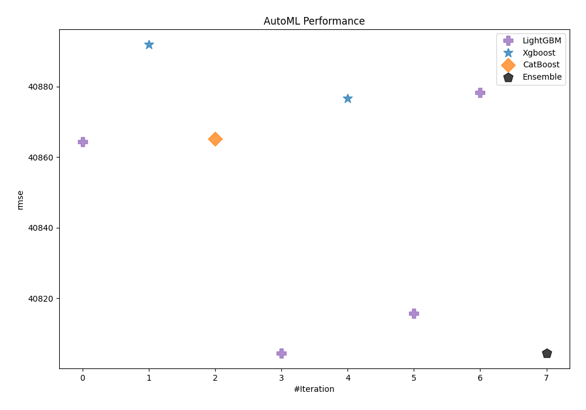
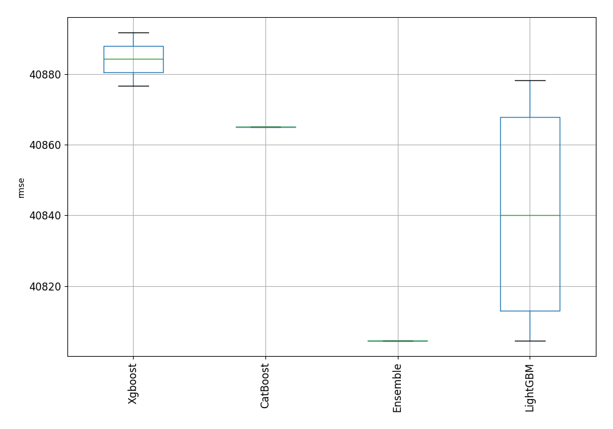
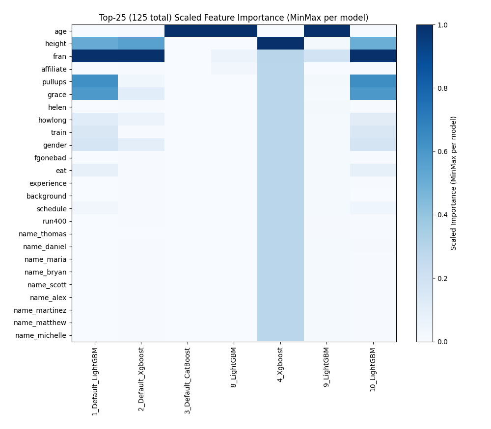

# AutoML Leaderboard

| Best model   | name                                               | model_type   | metric_type   |   metric_value |   train_time |   single_prediction_time |
|:-------------|:---------------------------------------------------|:-------------|:--------------|---------------:|-------------:|-------------------------:|
|              | [1_Default_LightGBM](1_Default_LightGBM/README.md) | LightGBM     | rmse          |        40864.4 |        82.68 |                   0.2406 |
|              | [2_Default_Xgboost](2_Default_Xgboost/README.md)   | Xgboost      | rmse          |        40891.8 |        78.98 |                   0.2536 |
|              | [3_Default_CatBoost](3_Default_CatBoost/README.md) | CatBoost     | rmse          |        40865.1 |       108.09 |                   0.2345 |
| **the best** | [8_LightGBM](8_LightGBM/README.md)                 | LightGBM     | rmse          |        40804.5 |        82.65 |                   0.2681 |
|              | [4_Xgboost](4_Xgboost/README.md)                   | Xgboost      | rmse          |        40876.7 |        82.3  |                   0.2702 |
|              | [9_LightGBM](9_LightGBM/README.md)                 | LightGBM     | rmse          |        40815.8 |        76.68 |                   0.2483 |
|              | [10_LightGBM](10_LightGBM/README.md)               | LightGBM     | rmse          |        40878.2 |        79.11 |                   0.2556 |
|              | [Ensemble](Ensemble/README.md)                     | Ensemble     | rmse          |        40804.5 |         0.09 |                   0.2473 |

### AutoML Performance

### AutoML Performance Boxplot

### Features Importance (Original Scale)

### Scaled Features Importance (MinMax per Model)

### Spearman Correlation of Models

