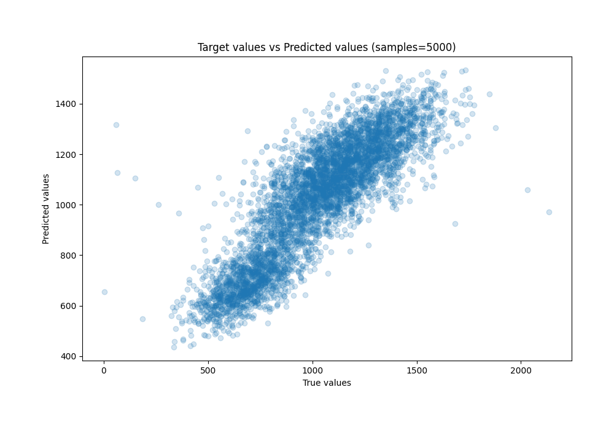
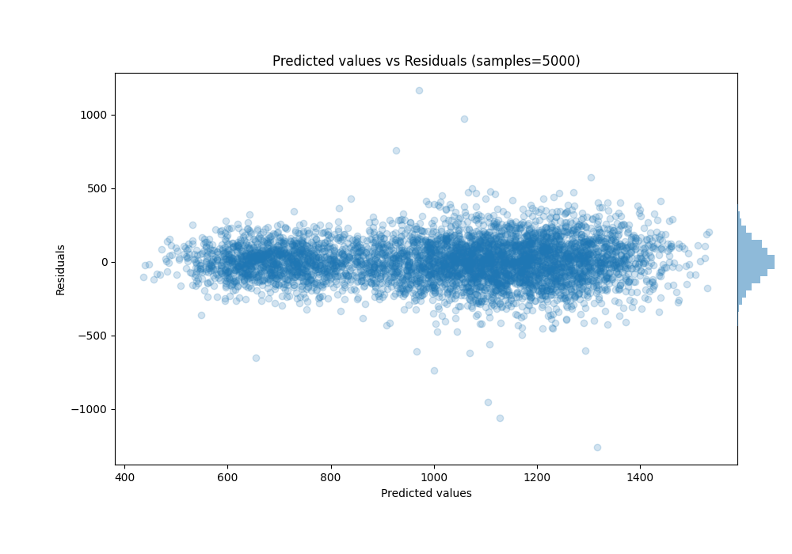

# Summary of Ensemble

[<< Go back](../README.md)

## Ensemble structure
| Model              |   Weight |
|:-------------------|---------:|
| 10_LightGBM        |        1 |
| 14_CatBoost        |        1 |
| 2_Default_Xgboost  |        1 |
| 3_Default_CatBoost |        2 |

### Metric details:
| Metric   |        Score |
|:---------|-------------:|
| MAE      |   106.452    |
| MSE      | 19371.2      |
| RMSE     |   139.18     |
| R2       |     0.747981 |
| MAPE     |     0.16745  |

## Learning curves

## True vs Predicted

## Predicted vs Residuals

[<< Go back](../README.md)
