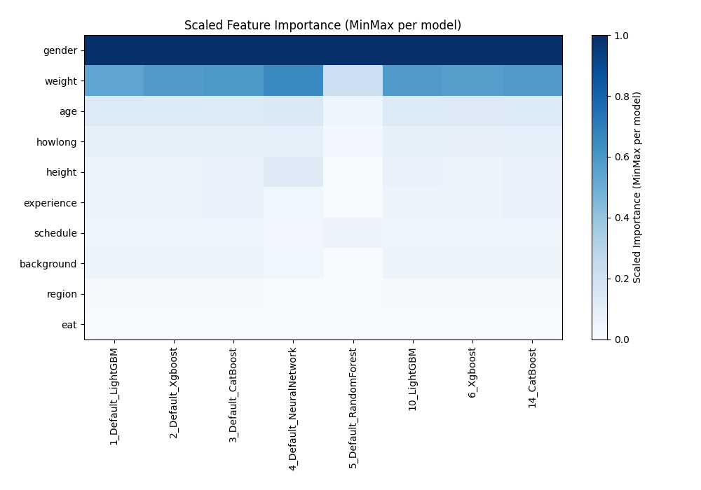

# AutoML Leaderboard

| Best model   | name                                                         | model_type     | metric_type   |   metric_value |   train_time |   single_prediction_time |
|:-------------|:-------------------------------------------------------------|:---------------|:--------------|---------------:|-------------:|-------------------------:|
|              | [1_Default_LightGBM](1_Default_LightGBM/README.md)           | LightGBM       | rmse          |        134.753 |        17.06 |                   0.0162 |
|              | [2_Default_Xgboost](2_Default_Xgboost/README.md)             | Xgboost        | rmse          |        134.579 |         6.21 |                   0.0169 |
|              | [3_Default_CatBoost](3_Default_CatBoost/README.md)           | CatBoost       | rmse          |        133.496 |        17.41 |                   0.0099 |
|              | [4_Default_NeuralNetwork](4_Default_NeuralNetwork/README.md) | Neural Network | rmse          |        141.773 |         8.17 |                   0.0389 |
|              | [5_Default_RandomForest](5_Default_RandomForest/README.md)   | Random Forest  | rmse          |        159.961 |        11.92 |                   0.0838 |
|              | [10_LightGBM](10_LightGBM/README.md)                         | LightGBM       | rmse          |        133.831 |        12.98 |                   0.0152 |
|              | [6_Xgboost](6_Xgboost/README.md)                             | Xgboost        | rmse          |        135.739 |         5.06 |                   0.0169 |
|              | [14_CatBoost](14_CatBoost/README.md)                         | CatBoost       | rmse          |        133.621 |        28.04 |                   0.0114 |
|              | [18_RandomForest](18_RandomForest/README.md)                 | Random Forest  | rmse          |        160.813 |        24.14 |                   0.0914 |
|              | [22_NeuralNetwork](22_NeuralNetwork/README.md)               | Neural Network | rmse          |        141.839 |         7.95 |                   0.0314 |
|              | [11_LightGBM](11_LightGBM/README.md)                         | LightGBM       | rmse          |        136.251 |         7.19 |                   0.0151 |
|              | [7_Xgboost](7_Xgboost/README.md)                             | Xgboost        | rmse          |        135.885 |         5.12 |                   0.0173 |
|              | [15_CatBoost](15_CatBoost/README.md)                         | CatBoost       | rmse          |        134.822 |        14.75 |                   0.0103 |
|              | [19_RandomForest](19_RandomForest/README.md)                 | Random Forest  | rmse          |        168.098 |        15.64 |                   0.0808 |
|              | [23_NeuralNetwork](23_NeuralNetwork/README.md)               | Neural Network | rmse          |        141.462 |         9.14 |                   0.0329 |
|              | [12_LightGBM](12_LightGBM/README.md)                         | LightGBM       | rmse          |        134.518 |        13.22 |                   0.015  |
|              | [8_Xgboost](8_Xgboost/README.md)                             | Xgboost        | rmse          |        135.005 |         5.23 |                   0.017  |
|              | [16_CatBoost](16_CatBoost/README.md)                         | CatBoost       | rmse          |        133.739 |        16.29 |                   0.0109 |
| **the best** | [Ensemble](Ensemble/README.md)                               | Ensemble       | rmse          |        132.796 |         0.38 |                   0.0986 |

### AutoML Performance

### AutoML Performance Boxplot

### Features Importance (Original Scale)

### Scaled Features Importance (MinMax per Model)

### Spearman Correlation of Models

