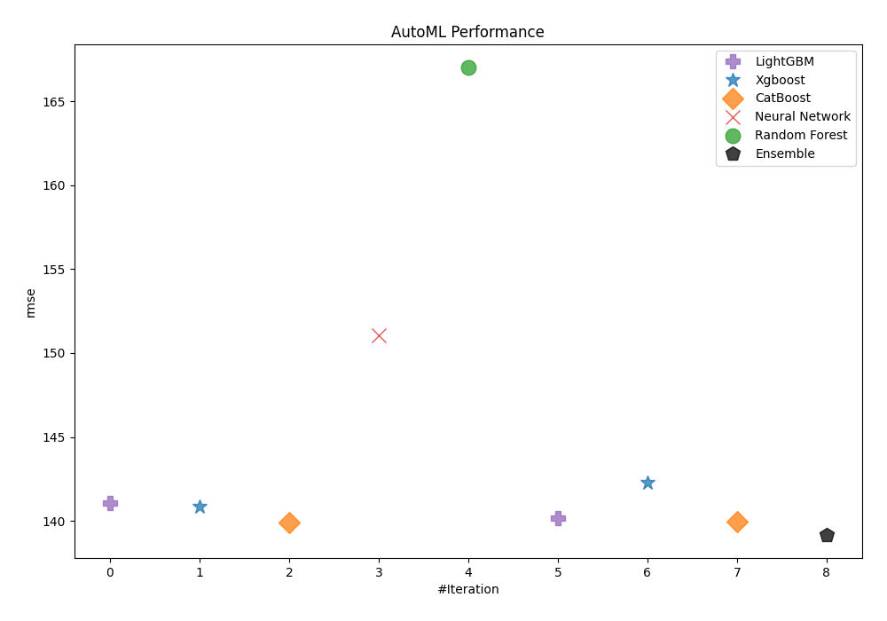

# AutoML Leaderboard

| Best model   | name                                                         | model_type     | metric_type   |   metric_value |   train_time |   single_prediction_time |
|:-------------|:-------------------------------------------------------------|:---------------|:--------------|---------------:|-------------:|-------------------------:|
|              | [1_Default_LightGBM](1_Default_LightGBM/README.md)           | LightGBM       | rmse          |        141.053 |        14.76 |                   0.0146 |
|              | [2_Default_Xgboost](2_Default_Xgboost/README.md)             | Xgboost        | rmse          |        140.832 |         4.45 |                   0.0187 |
|              | [3_Default_CatBoost](3_Default_CatBoost/README.md)           | CatBoost       | rmse          |        139.879 |        13.87 |                   0.0095 |
|              | [4_Default_NeuralNetwork](4_Default_NeuralNetwork/README.md) | Neural Network | rmse          |        151.076 |         7.55 |                   0.0283 |
|              | [5_Default_RandomForest](5_Default_RandomForest/README.md)   | Random Forest  | rmse          |        166.996 |        91.01 |                   0.0869 |
|              | [10_LightGBM](10_LightGBM/README.md)                         | LightGBM       | rmse          |        140.166 |        12.87 |                   0.0146 |
|              | [6_Xgboost](6_Xgboost/README.md)                             | Xgboost        | rmse          |        142.295 |         4.55 |                   0.017  |
|              | [14_CatBoost](14_CatBoost/README.md)                         | CatBoost       | rmse          |        139.952 |       845.68 |                   0.0096 |
| **the best** | [Ensemble](Ensemble/README.md)                               | Ensemble       | rmse          |        139.18  |         0.1  |                   0.1128 |

### AutoML Performance

### AutoML Performance Boxplot

### Features Importance (Original Scale)

### Scaled Features Importance (MinMax per Model)

### Spearman Correlation of Models

