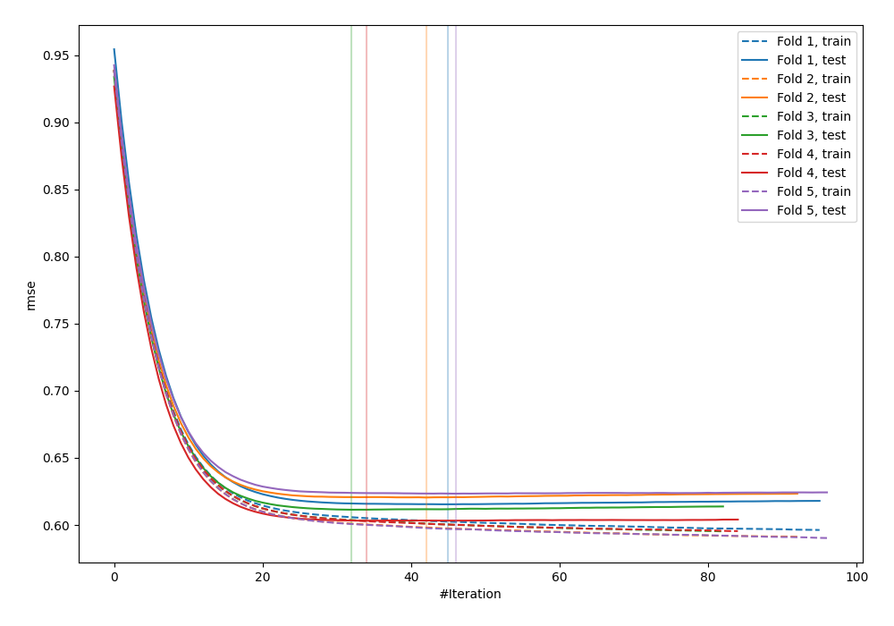
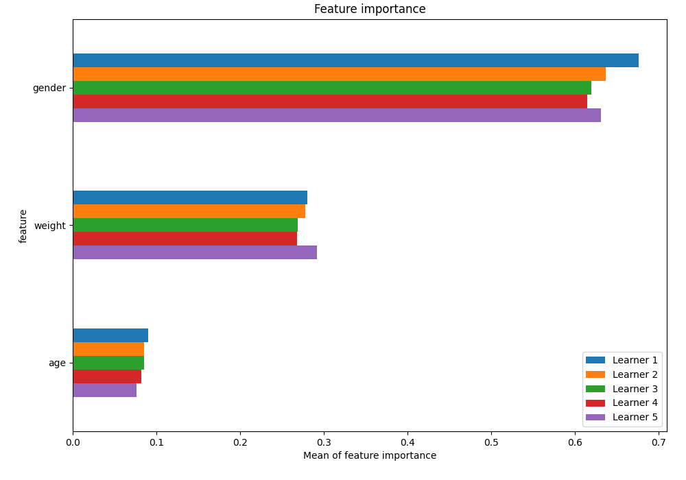
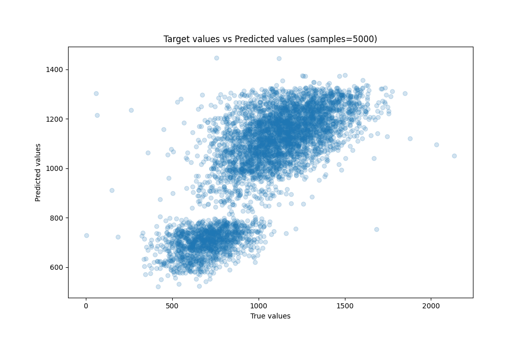
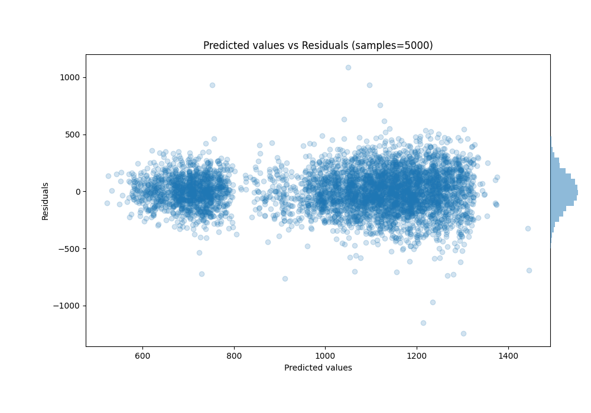

# Summary of 19_Xgboost

[<< Go back](../README.md)

## Extreme Gradient Boosting (Xgboost)
- **n_jobs**: -1
- **objective**: reg:squarederror
- **eta**: 0.1
- **max_depth**: 6
- **min_child_weight**: 1
- **subsample**: 1.0
- **colsample_bytree**: 1.0
- **eval_metric**: rmse
- **explain_level**: 1

## Validation
 - **validation_type**: kfold
 - **k_folds**: 5
 - **shuffle**: True

## Optimized metric
rmse

## Training time

1.6 seconds

### Metric details:
| Metric   |        Score |
|:---------|-------------:|
| MAE      |   132.481    |
| MSE      | 29051.4      |
| RMSE     |   170.445    |
| R2       |     0.622041 |
| MAPE     |     0.19421  |

## Learning curves

## Permutation-based Importance

## True vs Predicted

## Predicted vs Residuals

[<< Go back](../README.md)
