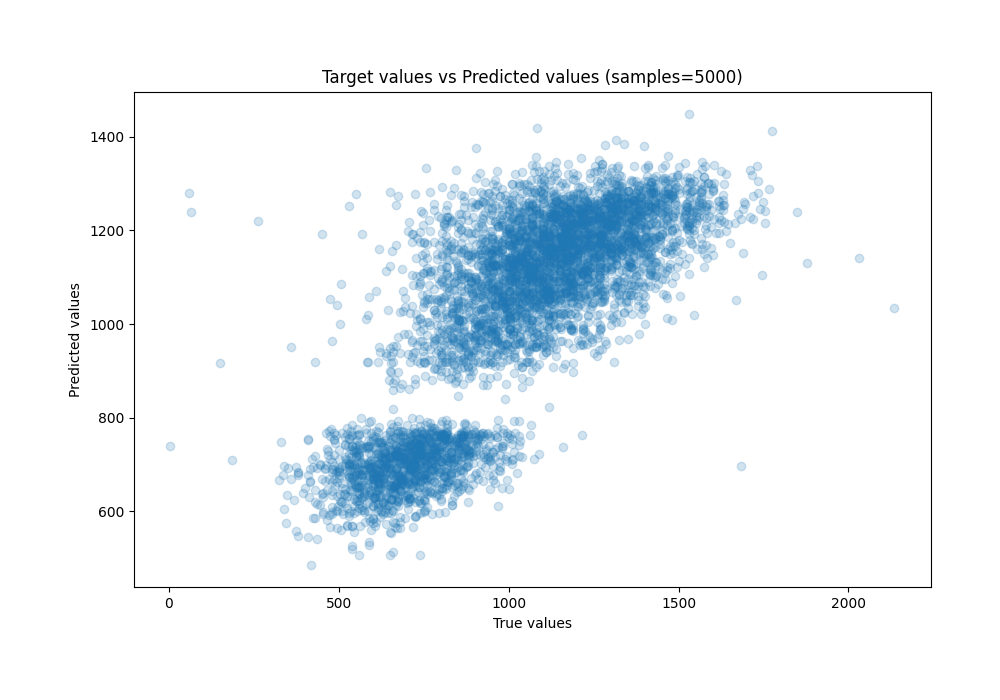

# Summary of 21_NeuralNetwork

[<< Go back](../README.md)

## Neural Network
- **n_jobs**: -1
- **dense_1_size**: 32
- **dense_2_size**: 16
- **learning_rate**: 0.08
- **explain_level**: 1

## Validation
 - **validation_type**: kfold
 - **k_folds**: 5
 - **shuffle**: True

## Optimized metric
rmse

## Training time

3.8 seconds

### Metric details:
| Metric   |        Score |
|:---------|-------------:|
| MAE      |   133.129    |
| MSE      | 29324.9      |
| RMSE     |   171.245    |
| R2       |     0.618484 |
| MAPE     |     0.194396 |

## Learning curves

## Permutation-based Importance

## True vs Predicted

## Predicted vs Residuals

[<< Go back](../README.md)
