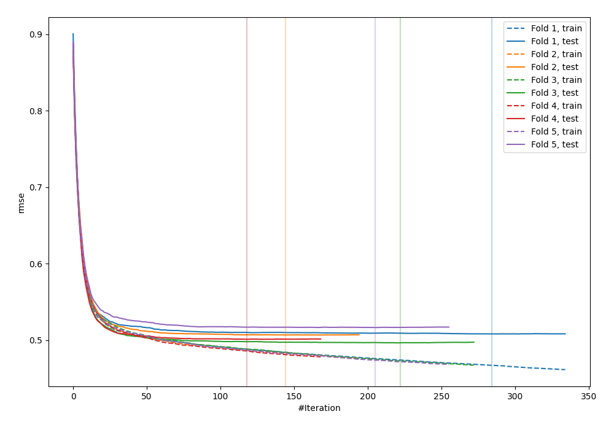
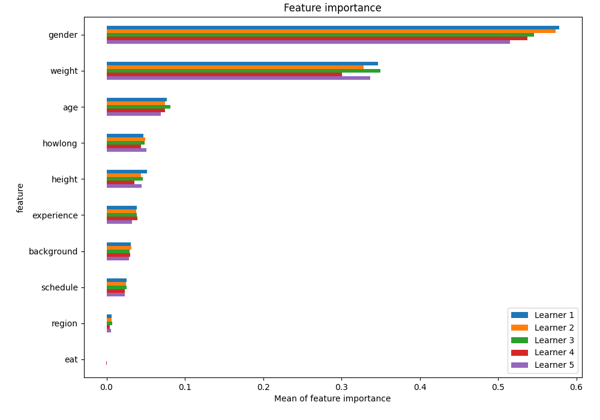
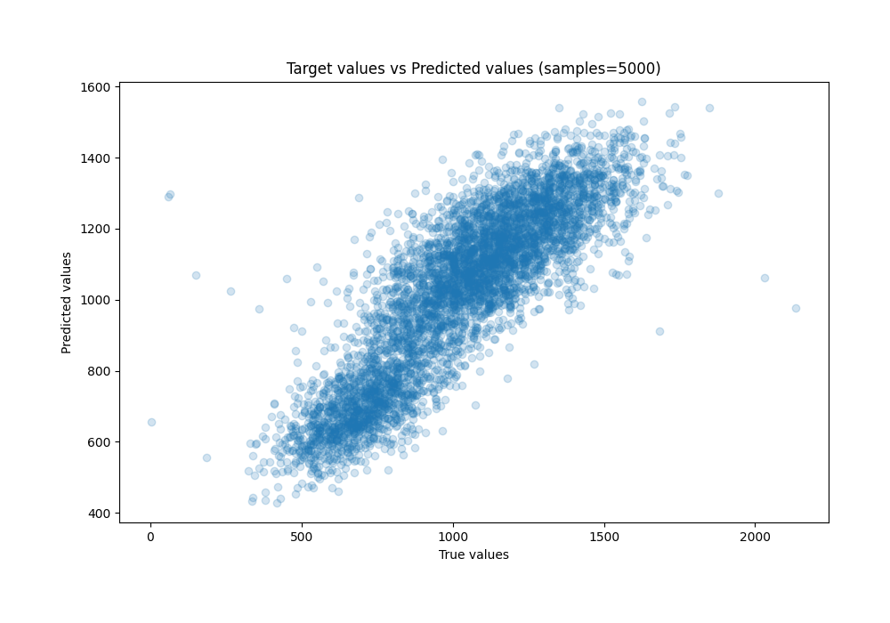
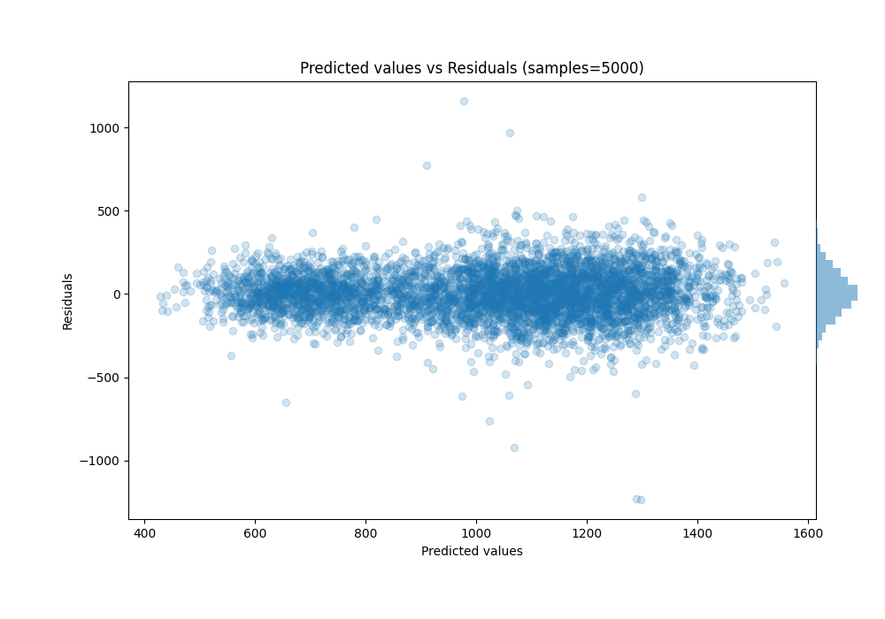

# Summary of 29_CatBoost

[<< Go back](../README.md)

## CatBoost
- **n_jobs**: -1
- **learning_rate**: 0.2
- **depth**: 6
- **rsm**: 1
- **loss_function**: RMSE
- **eval_metric**: RMSE
- **explain_level**: 1

## Validation
 - **validation_type**: kfold
 - **k_folds**: 5
 - **shuffle**: True

## Optimized metric
rmse

## Training time

9.3 seconds

### Metric details:
| Metric   |        Score |
|:---------|-------------:|
| MAE      |   107.333    |
| MSE      | 19661.6      |
| RMSE     |   140.22     |
| R2       |     0.744202 |
| MAPE     |     0.168014 |

## Learning curves

## Permutation-based Importance

## True vs Predicted

## Predicted vs Residuals

[<< Go back](../README.md)
