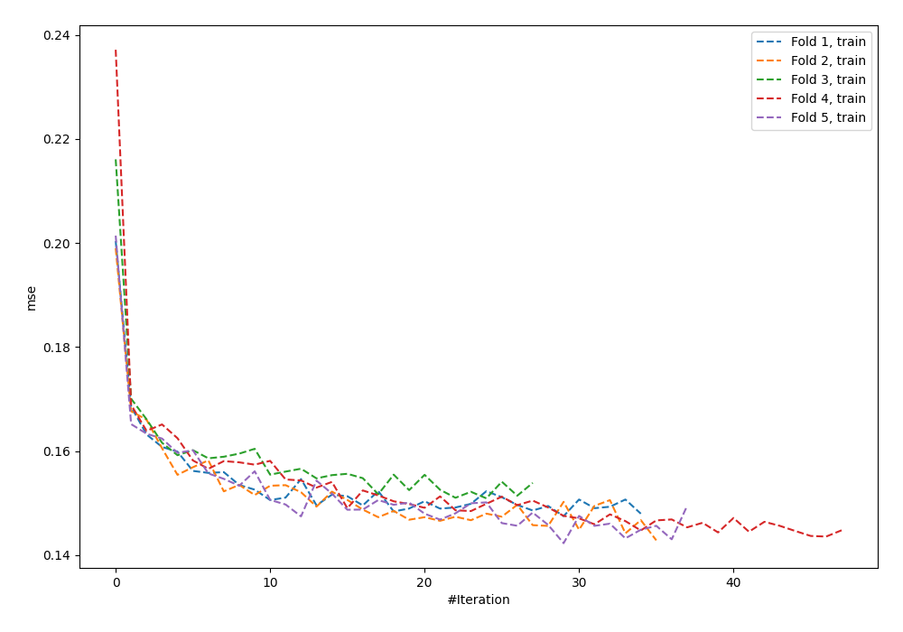
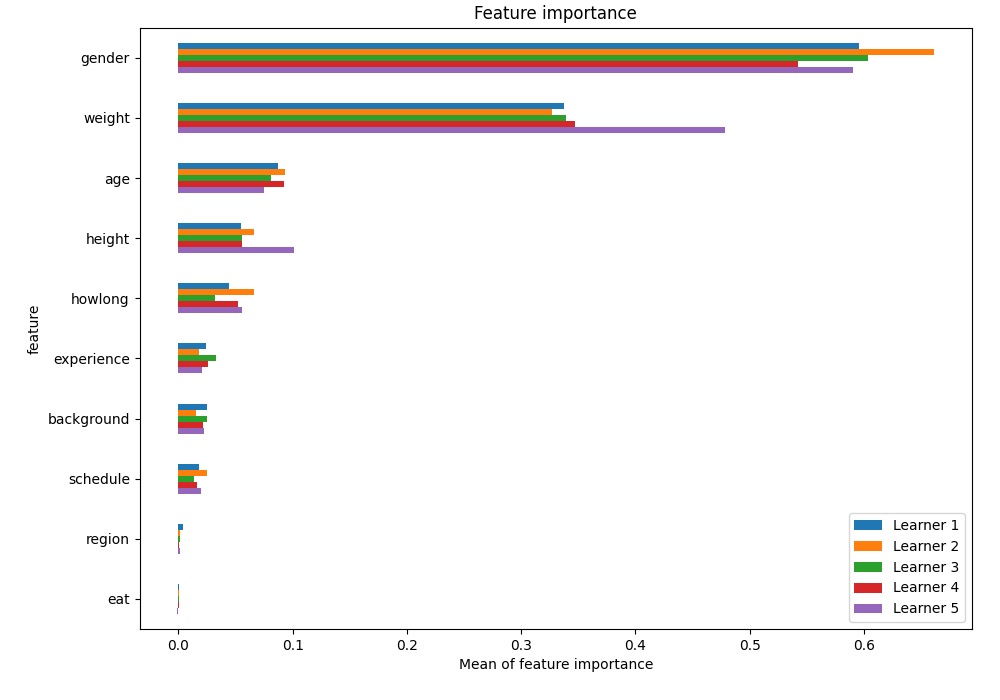
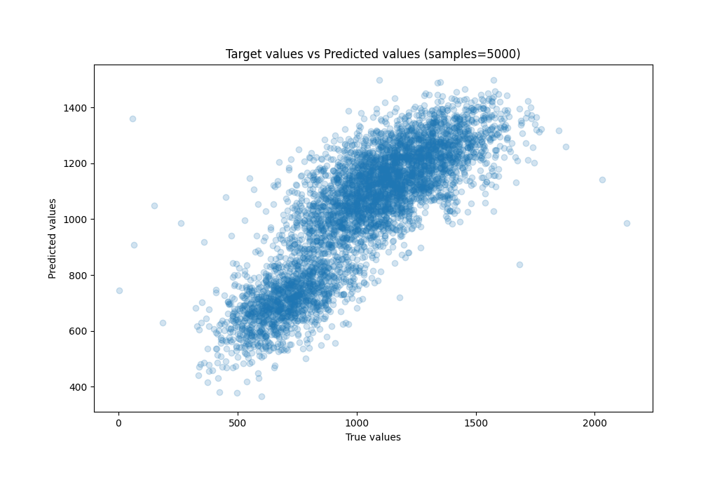
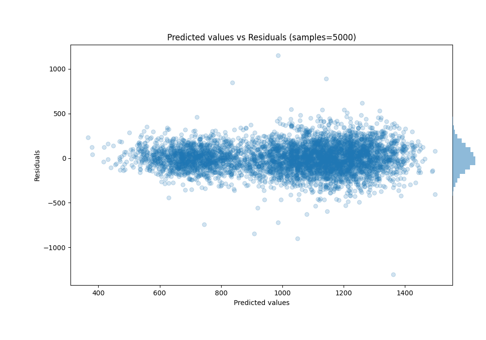

# Summary of 38_NeuralNetwork

[<< Go back](../README.md)

## Neural Network
- **n_jobs**: -1
- **dense_1_size**: 64
- **dense_2_size**: 16
- **learning_rate**: 0.05
- **explain_level**: 1

## Validation
 - **validation_type**: kfold
 - **k_folds**: 5
 - **shuffle**: True

## Optimized metric
rmse

## Training time

9.1 seconds

### Metric details:
| Metric   |        Score |
|:---------|-------------:|
| MAE      |   115.528    |
| MSE      | 22502        |
| RMSE     |   150.007    |
| R2       |     0.70725  |
| MAPE     |     0.177053 |

## Learning curves

## Permutation-based Importance

## True vs Predicted

## Predicted vs Residuals

[<< Go back](../README.md)
