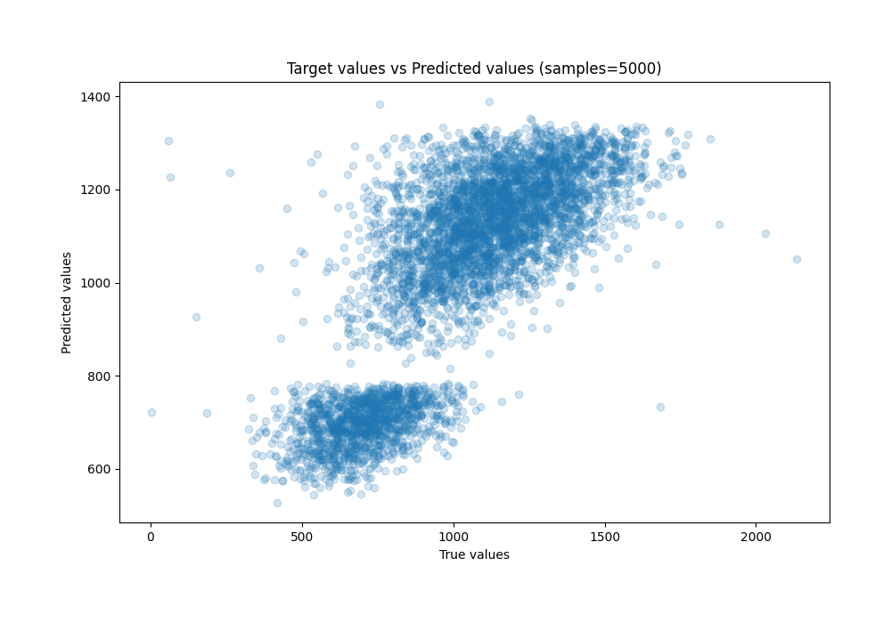
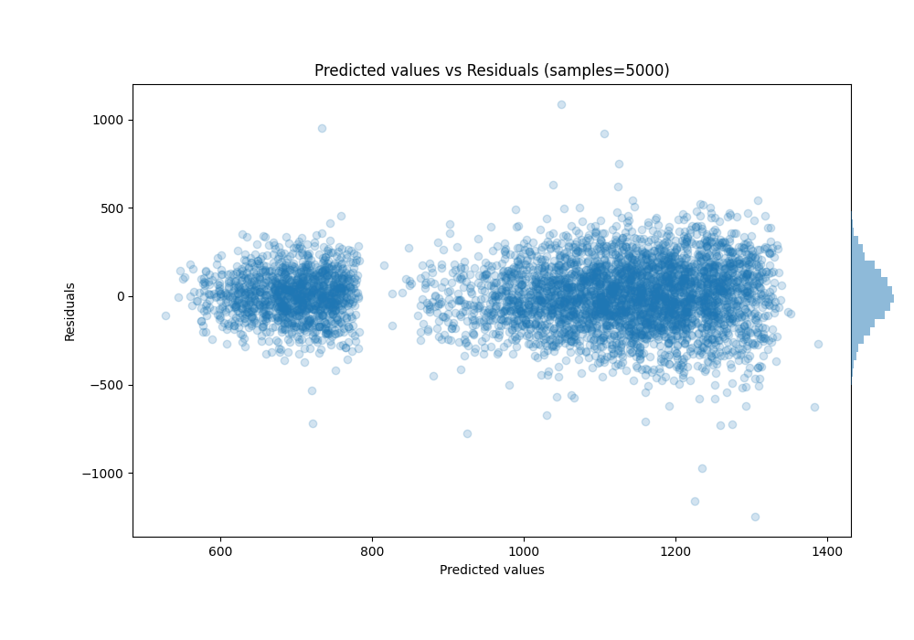

# Summary of Ensemble

[<< Go back](../README.md)

## Ensemble structure
| Model                   |   Weight |
|:------------------------|---------:|
| 14_CatBoost             |        2 |
| 16_CatBoost             |        1 |
| 17_CatBoost             |        1 |
| 19_Xgboost              |        2 |
| 20_NeuralNetwork        |        2 |
| 3_Default_CatBoost      |        4 |
| 4_Default_NeuralNetwork |        1 |

### Metric details:
| Metric   |        Score |
|:---------|-------------:|
| MAE      |   131.979    |
| MSE      | 28862.7      |
| RMSE     |   169.89     |
| R2       |     0.624496 |
| MAPE     |     0.19343  |

## Learning curves

## True vs Predicted

## Predicted vs Residuals

[<< Go back](../README.md)
