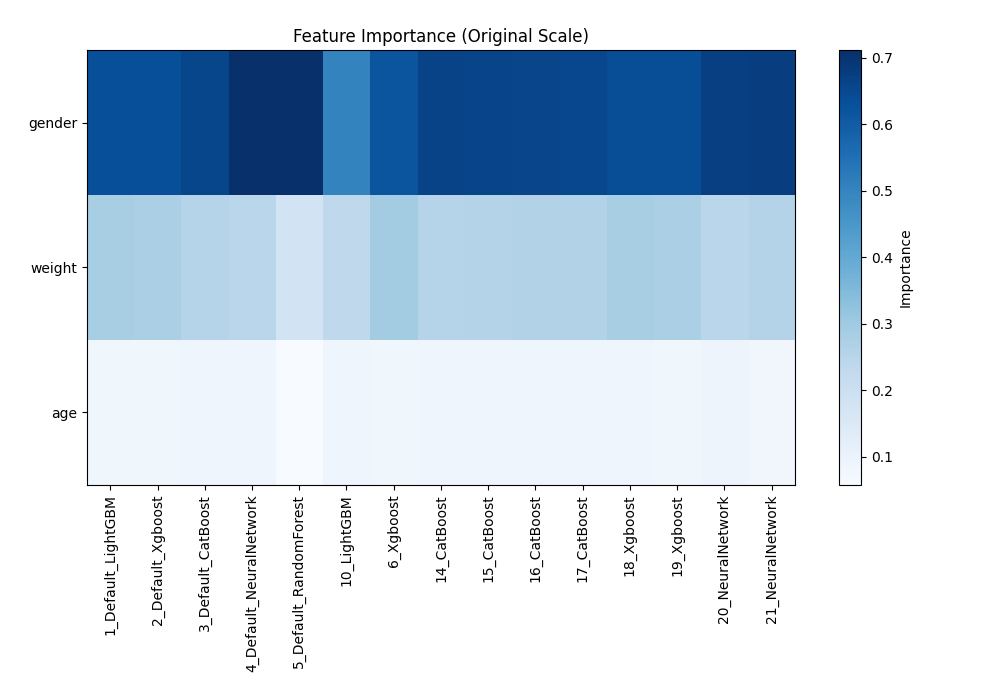
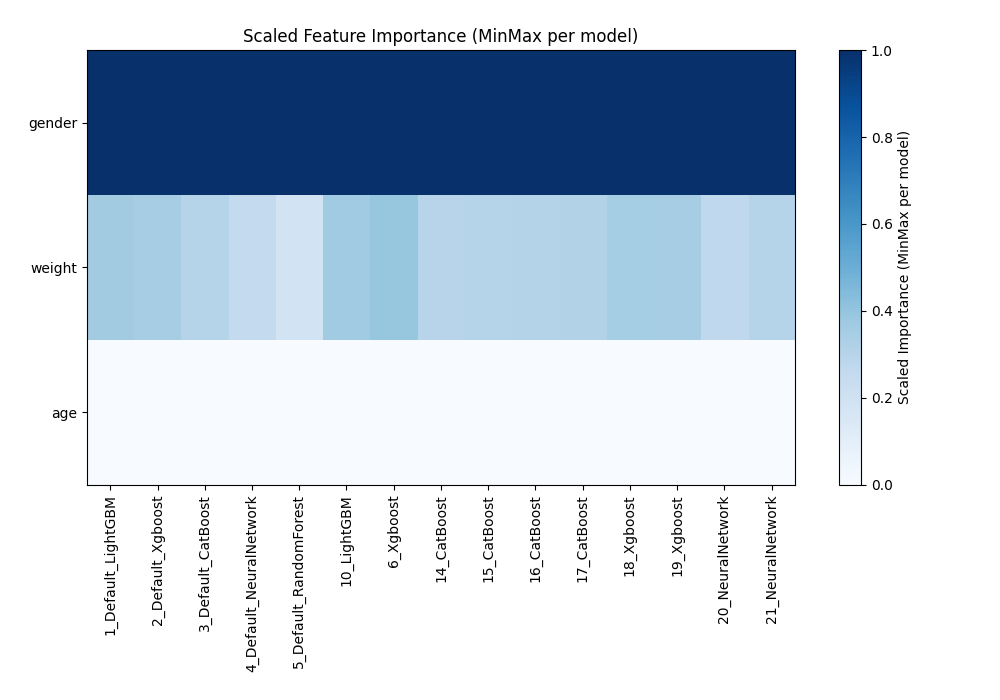

# AutoML Leaderboard

| Best model   | name                                                         | model_type     | metric_type   |   metric_value |   train_time |   single_prediction_time |
|:-------------|:-------------------------------------------------------------|:---------------|:--------------|---------------:|-------------:|-------------------------:|
|              | [1_Default_LightGBM](1_Default_LightGBM/README.md)           | LightGBM       | rmse          |        170.896 |         5.31 |                   0.0089 |
|              | [2_Default_Xgboost](2_Default_Xgboost/README.md)             | Xgboost        | rmse          |        170.468 |         2.01 |                   0.0101 |
|              | [3_Default_CatBoost](3_Default_CatBoost/README.md)           | CatBoost       | rmse          |        169.979 |         1.97 |                   0.0088 |
|              | [4_Default_NeuralNetwork](4_Default_NeuralNetwork/README.md) | Neural Network | rmse          |        170.801 |         4.68 |                   0.0146 |
|              | [5_Default_RandomForest](5_Default_RandomForest/README.md)   | Random Forest  | rmse          |        172.298 |         5.72 |                   0.0874 |
|              | [10_LightGBM](10_LightGBM/README.md)                         | LightGBM       | rmse          |        172.388 |         3.95 |                   0.0089 |
|              | [6_Xgboost](6_Xgboost/README.md)                             | Xgboost        | rmse          |        171.529 |         2.09 |                   0.0105 |
|              | [14_CatBoost](14_CatBoost/README.md)                         | CatBoost       | rmse          |        169.973 |       542.65 |                   0.0084 |
|              | [15_CatBoost](15_CatBoost/README.md)                         | CatBoost       | rmse          |        170.015 |         9.68 |                   0.0084 |
|              | [16_CatBoost](16_CatBoost/README.md)                         | CatBoost       | rmse          |        169.981 |         2.76 |                   0.0083 |
|              | [17_CatBoost](17_CatBoost/README.md)                         | CatBoost       | rmse          |        170.025 |         3.35 |                   0.0083 |
|              | [18_Xgboost](18_Xgboost/README.md)                           | Xgboost        | rmse          |        170.467 |         2.33 |                   0.0104 |
|              | [19_Xgboost](19_Xgboost/README.md)                           | Xgboost        | rmse          |        170.445 |         1.86 |                   0.0102 |
|              | [20_NeuralNetwork](20_NeuralNetwork/README.md)               | Neural Network | rmse          |        170.405 |         4.28 |                   0.0149 |
|              | [21_NeuralNetwork](21_NeuralNetwork/README.md)               | Neural Network | rmse          |        171.245 |         4.04 |                   0.0145 |
| **the best** | [Ensemble](Ensemble/README.md)                               | Ensemble       | rmse          |        169.89  |         0.2  |                   0.0728 |

### AutoML Performance

### AutoML Performance Boxplot

### Features Importance (Original Scale)

### Scaled Features Importance (MinMax per Model)

### Spearman Correlation of Models

