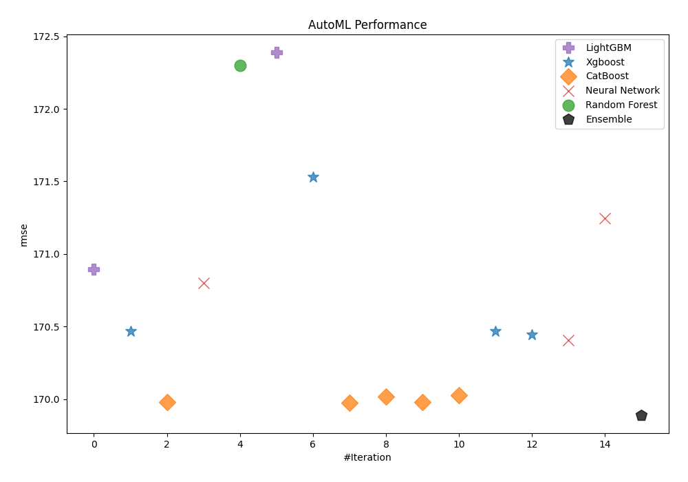

# AutoML Leaderboard

| Best model   | name                                                                             | model_type     | metric_type   |   metric_value |   train_time |   single_prediction_time |
|:-------------|:---------------------------------------------------------------------------------|:---------------|:--------------|---------------:|-------------:|-------------------------:|
|              | [1_Default_LightGBM](1_Default_LightGBM/README.md)                               | LightGBM       | rmse          |        141.053 |        16.25 |                   0.0267 |
|              | [2_Default_Xgboost](2_Default_Xgboost/README.md)                                 | Xgboost        | rmse          |        140.832 |         5.14 |                   0.0168 |
|              | [3_Default_CatBoost](3_Default_CatBoost/README.md)                               | CatBoost       | rmse          |        139.879 |        14.73 |                   0.0096 |
|              | [4_Default_NeuralNetwork](4_Default_NeuralNetwork/README.md)                     | Neural Network | rmse          |        151.076 |        12.06 |                   0.0382 |
|              | [5_Default_RandomForest](5_Default_RandomForest/README.md)                       | Random Forest  | rmse          |        166.996 |        12.15 |                   0.0877 |
|              | [10_LightGBM](10_LightGBM/README.md)                                             | LightGBM       | rmse          |        140.166 |        17.32 |                   0.0185 |
|              | [6_Xgboost](6_Xgboost/README.md)                                                 | Xgboost        | rmse          |        142.295 |         5.25 |                   0.0171 |
|              | [14_CatBoost](14_CatBoost/README.md)                                             | CatBoost       | rmse          |        139.952 |        27.59 |                   0.0098 |
|              | [18_RandomForest](18_RandomForest/README.md)                                     | Random Forest  | rmse          |        165.693 |         9.61 |                   0.086  |
|              | [22_NeuralNetwork](22_NeuralNetwork/README.md)                                   | Neural Network | rmse          |        151.287 |         7.51 |                   0.0299 |
|              | [11_LightGBM](11_LightGBM/README.md)                                             | LightGBM       | rmse          |        141.572 |         6.21 |                   0.0159 |
|              | [7_Xgboost](7_Xgboost/README.md)                                                 | Xgboost        | rmse          |        142.467 |         4.84 |                   0.0168 |
|              | [15_CatBoost](15_CatBoost/README.md)                                             | CatBoost       | rmse          |        140.663 |        17.59 |                   0.0095 |
|              | [19_RandomForest](19_RandomForest/README.md)                                     | Random Forest  | rmse          |        172.158 |         9.13 |                   0.0831 |
|              | [23_NeuralNetwork](23_NeuralNetwork/README.md)                                   | Neural Network | rmse          |        149.387 |         8.78 |                   0.0284 |
|              | [12_LightGBM](12_LightGBM/README.md)                                             | LightGBM       | rmse          |        140.962 |        13.91 |                   0.0149 |
|              | [8_Xgboost](8_Xgboost/README.md)                                                 | Xgboost        | rmse          |        140.801 |         4.88 |                   0.017  |
|              | [16_CatBoost](16_CatBoost/README.md)                                             | CatBoost       | rmse          |        140.31  |        13.48 |                   0.01   |
|              | [20_RandomForest](20_RandomForest/README.md)                                     | Random Forest  | rmse          |        157.964 |        17.84 |                   0.0963 |
|              | [24_NeuralNetwork](24_NeuralNetwork/README.md)                                   | Neural Network | rmse          |        152.47  |        10.44 |                   0.0285 |
|              | [13_LightGBM](13_LightGBM/README.md)                                             | LightGBM       | rmse          |        141.67  |        15.34 |                   0.0147 |
|              | [9_Xgboost](9_Xgboost/README.md)                                                 | Xgboost        | rmse          |        141.798 |         4.49 |                   0.0166 |
|              | [17_CatBoost](17_CatBoost/README.md)                                             | CatBoost       | rmse          |        141.953 |         8.08 |                   0.0093 |
|              | [21_RandomForest](21_RandomForest/README.md)                                     | Random Forest  | rmse          |        157.44  |        20.97 |                   0.0832 |
|              | [25_NeuralNetwork](25_NeuralNetwork/README.md)                                   | Neural Network | rmse          |        151.519 |        10.37 |                   0.0291 |
|              | [3_Default_CatBoost_GoldenFeatures](3_Default_CatBoost_GoldenFeatures/README.md) | CatBoost       | rmse          |        139.949 |        15.29 |                   0.0249 |
|              | [14_CatBoost_GoldenFeatures](14_CatBoost_GoldenFeatures/README.md)               | CatBoost       | rmse          |        139.627 |        30.77 |                   0.0256 |
|              | [10_LightGBM_GoldenFeatures](10_LightGBM_GoldenFeatures/README.md)               | LightGBM       | rmse          |        140.169 |        17.71 |                   0.0285 |
|              | [26_CatBoost_GoldenFeatures](26_CatBoost_GoldenFeatures/README.md)               | CatBoost       | rmse          |        139.644 |        52.43 |                   0.0243 |
|              | [27_CatBoost_GoldenFeatures](27_CatBoost_GoldenFeatures/README.md)               | CatBoost       | rmse          |        139.887 |        18.29 |                   0.0262 |
|              | [28_CatBoost](28_CatBoost/README.md)                                             | CatBoost       | rmse          |        139.792 |        31.28 |                   0.0104 |
|              | [29_CatBoost](29_CatBoost/README.md)                                             | CatBoost       | rmse          |        140.22  |         9.62 |                   0.0098 |
|              | [30_LightGBM](30_LightGBM/README.md)                                             | LightGBM       | rmse          |        140.351 |         8.77 |                   0.0154 |
|              | [31_LightGBM_GoldenFeatures](31_LightGBM_GoldenFeatures/README.md)               | LightGBM       | rmse          |        140.321 |        11.57 |                   0.0286 |
|              | [32_Xgboost](32_Xgboost/README.md)                                               | Xgboost        | rmse          |        140.555 |         5.2  |                   0.0167 |
|              | [33_Xgboost](33_Xgboost/README.md)                                               | Xgboost        | rmse          |        141.18  |         5.38 |                   0.0165 |
|              | [34_Xgboost](34_Xgboost/README.md)                                               | Xgboost        | rmse          |        140.469 |         5.23 |                   0.0187 |
|              | [35_Xgboost](35_Xgboost/README.md)                                               | Xgboost        | rmse          |        141.584 |         5.49 |                   0.0167 |
|              | [36_NeuralNetwork](36_NeuralNetwork/README.md)                                   | Neural Network | rmse          |        149.262 |         8.97 |                   0.0301 |
|              | [37_NeuralNetwork](37_NeuralNetwork/README.md)                                   | Neural Network | rmse          |        153.63  |         6.36 |                   0.0282 |
|              | [38_NeuralNetwork](38_NeuralNetwork/README.md)                                   | Neural Network | rmse          |        150.007 |         9.38 |                   0.0302 |
|              | [39_CatBoost_GoldenFeatures](39_CatBoost_GoldenFeatures/README.md)               | CatBoost       | rmse          |        139.789 |        28.58 |                   0.0287 |
| **the best** | [Ensemble](Ensemble/README.md)                                                   | Ensemble       | rmse          |        138.929 |         1.41 |                   0.2275 |

### AutoML Performance

### AutoML Performance Boxplot

### Features Importance (Original Scale)

### Scaled Features Importance (MinMax per Model)

### Spearman Correlation of Models

