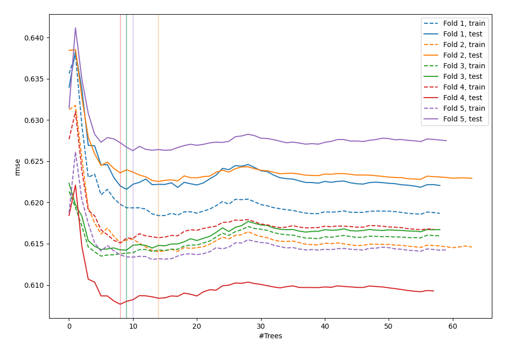
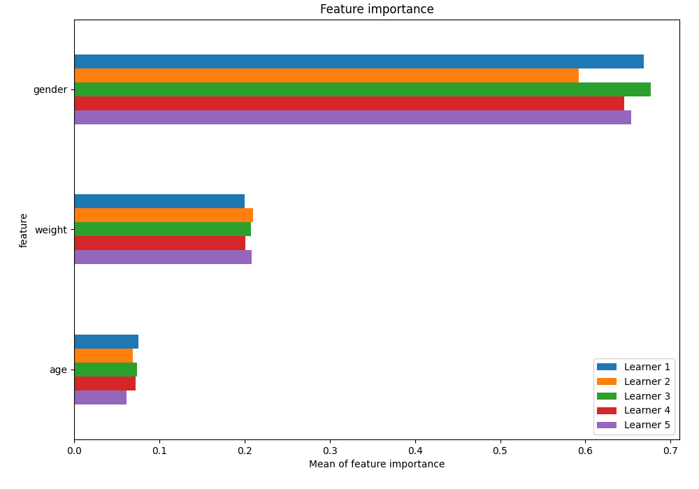
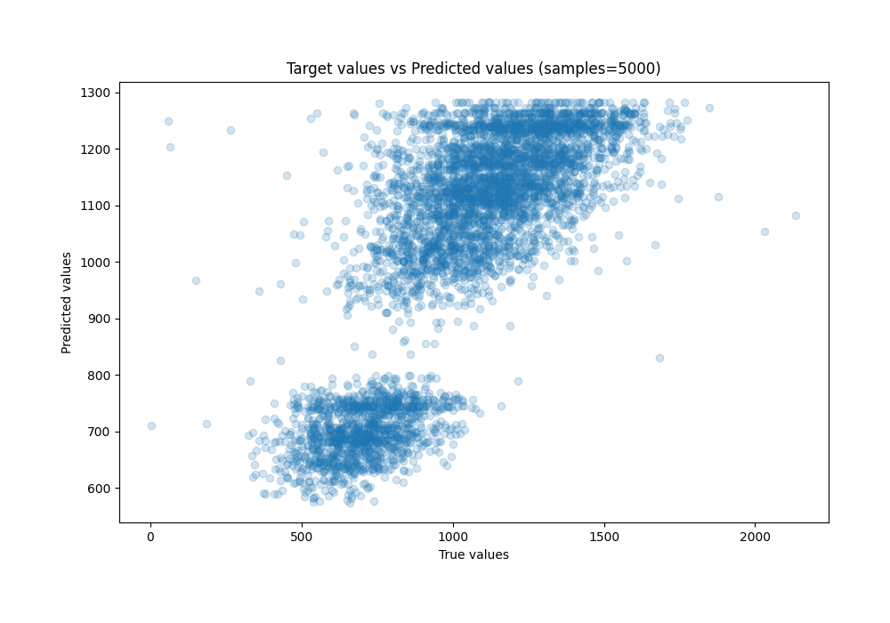
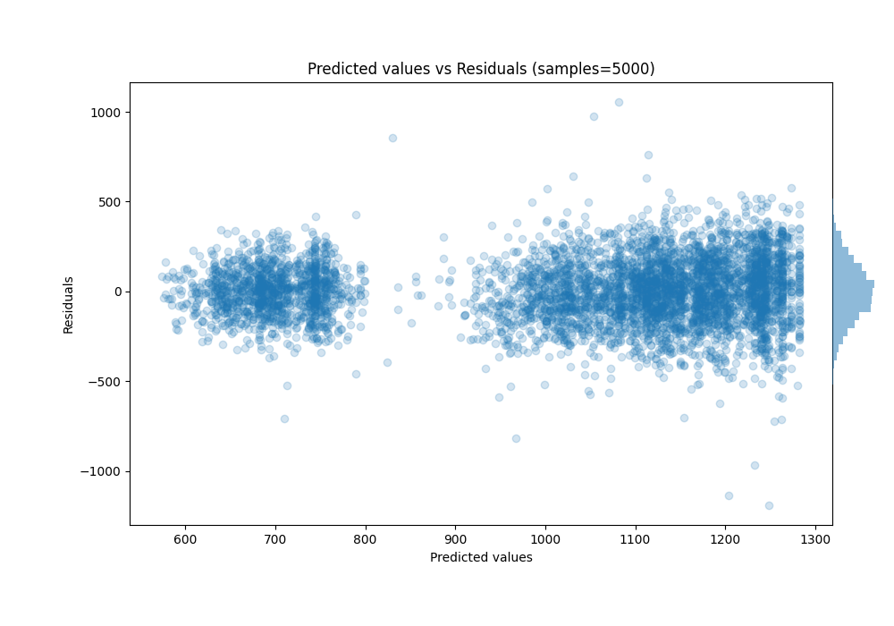

# Summary of 35_RandomForest

[<< Go back](../README.md)

## Random Forest
- **n_jobs**: -1
- **criterion**: squared_error
- **max_features**: 0.6
- **min_samples_split**: 50
- **max_depth**: 5
- **eval_metric_name**: rmse
- **explain_level**: 1

## Validation
 - **validation_type**: kfold
 - **k_folds**: 5
 - **shuffle**: True

## Optimized metric
rmse

## Training time

4.1 seconds

### Metric details:
| Metric   |        Score |
|:---------|-------------:|
| MAE      |   133.651    |
| MSE      | 29402.1      |
| RMSE     |   171.47     |
| R2       |     0.617479 |
| MAPE     |     0.195119 |

## Learning curves

## Permutation-based Importance

## True vs Predicted

## Predicted vs Residuals

[<< Go back](../README.md)
