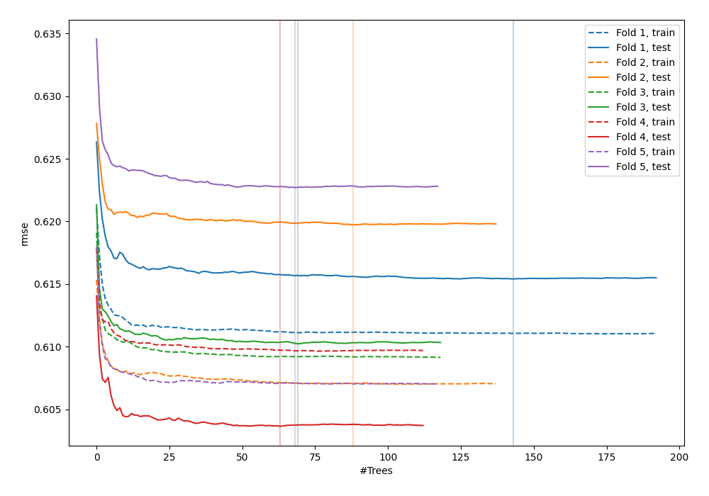
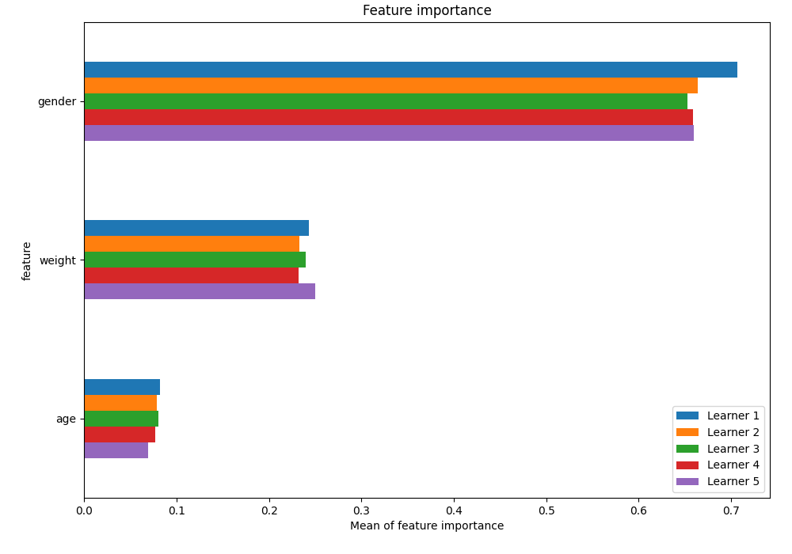
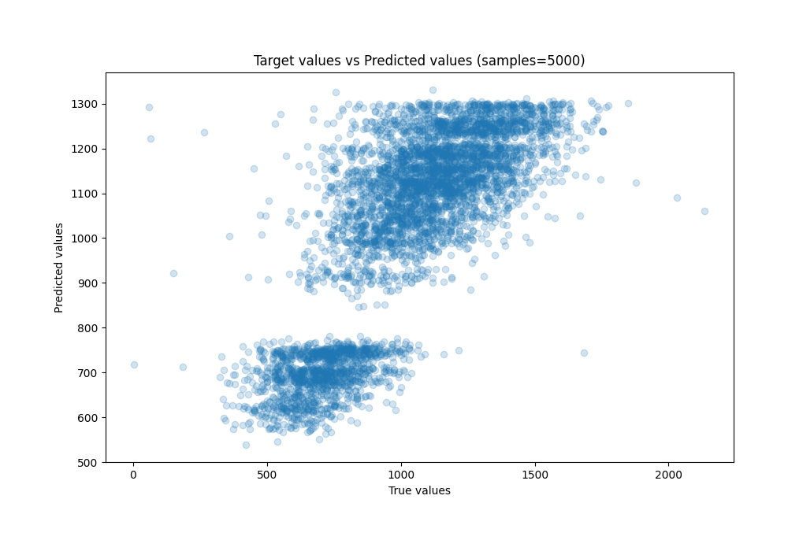

# Summary of 47_RandomForest

[<< Go back](../README.md)

## Random Forest
- **n_jobs**: -1
- **criterion**: squared_error
- **max_features**: 0.9
- **min_samples_split**: 40
- **max_depth**: 6
- **eval_metric_name**: rmse
- **explain_level**: 1

## Validation
 - **validation_type**: kfold
 - **k_folds**: 5
 - **shuffle**: True

## Optimized metric
rmse

## Training time

6.8 seconds

### Metric details:
| Metric   |        Score |
|:---------|-------------:|
| MAE      |   132.509    |
| MSE      | 29011.7      |
| RMSE     |   170.328    |
| R2       |     0.622558 |
| MAPE     |     0.1938   |

## Learning curves

## Permutation-based Importance

## True vs Predicted

## Predicted vs Residuals

[<< Go back](../README.md)
