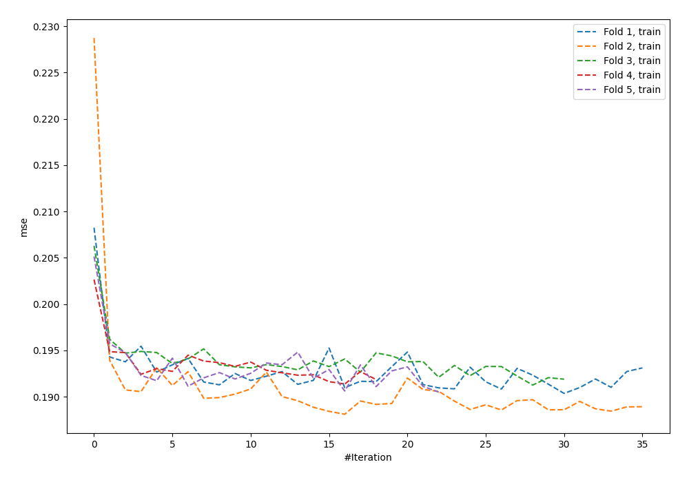
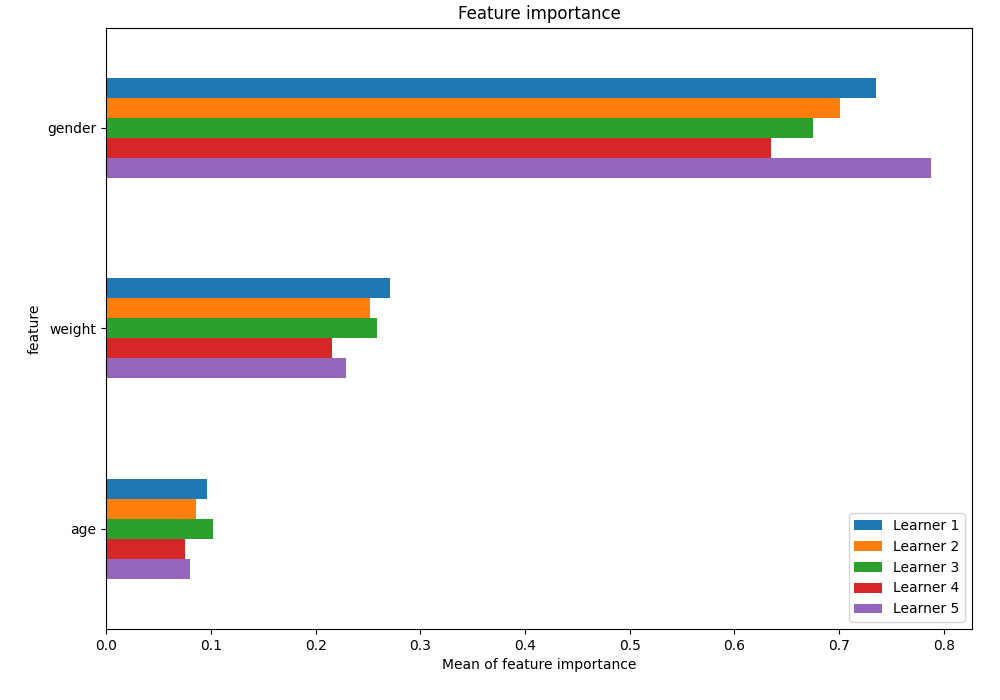
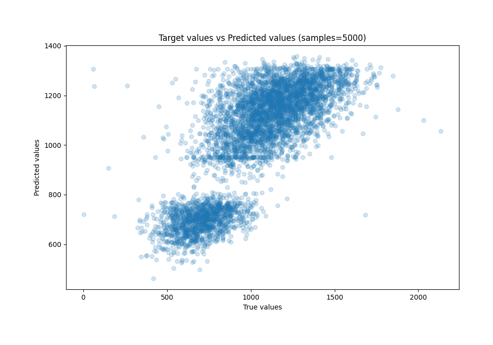
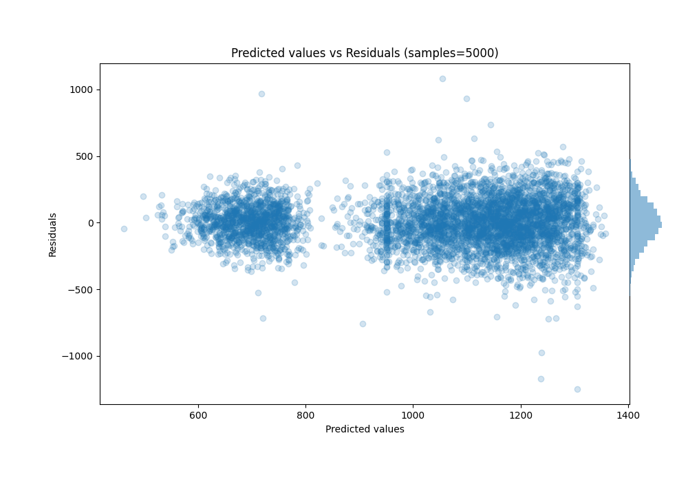

# Summary of 4_Default_NeuralNetwork

[<< Go back](../README.md)

## Neural Network
- **n_jobs**: -1
- **dense_1_size**: 32
- **dense_2_size**: 16
- **learning_rate**: 0.05
- **explain_level**: 1

## Validation
 - **validation_type**: kfold
 - **k_folds**: 5
 - **shuffle**: True

## Optimized metric
rmse

## Training time

8.0 seconds

### Metric details:
| Metric   |        Score |
|:---------|-------------:|
| MAE      |   132.784    |
| MSE      | 29172.8      |
| RMSE     |   170.801    |
| R2       |     0.620462 |
| MAPE     |     0.19442  |

## Learning curves

## Permutation-based Importance

## True vs Predicted

## Predicted vs Residuals

[<< Go back](../README.md)
