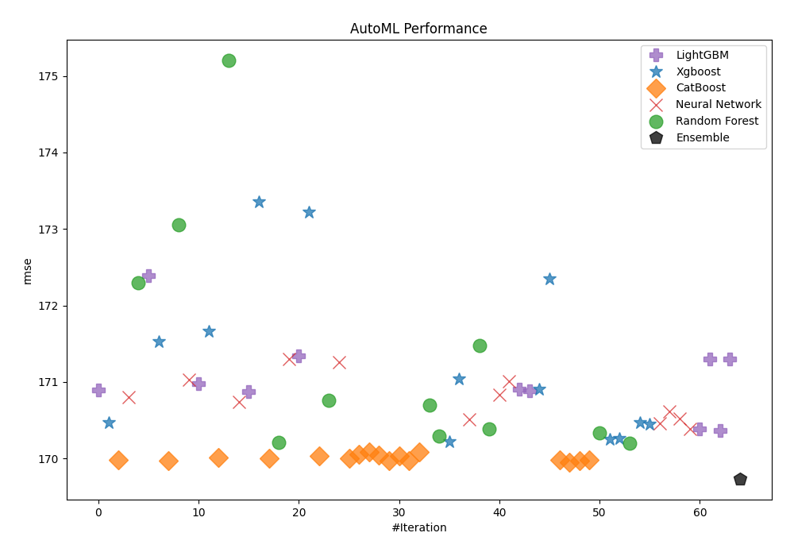
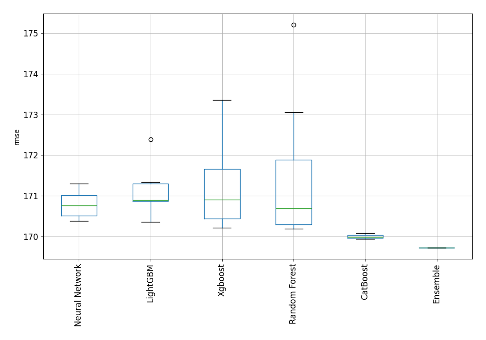
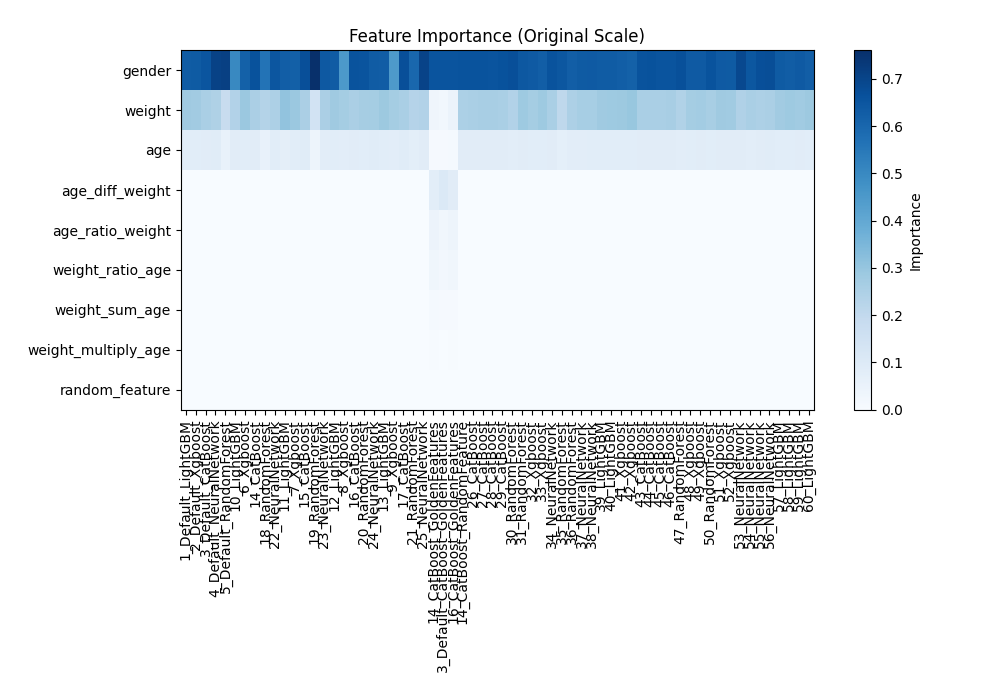
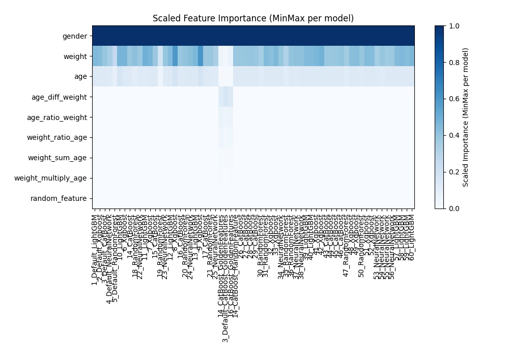
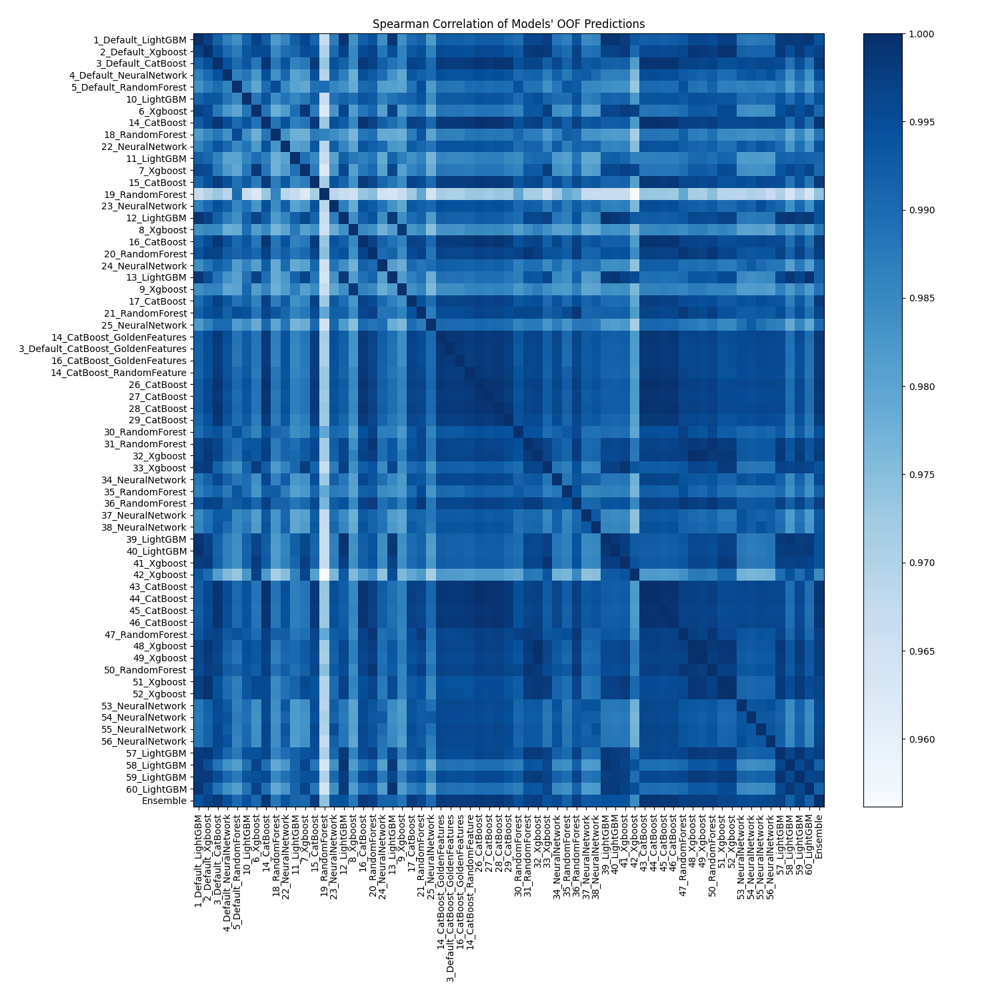

# AutoML Leaderboard

| Best model   | name                                                                             | model_type     | metric_type   |   metric_value |   train_time |   single_prediction_time |
|:-------------|:---------------------------------------------------------------------------------|:---------------|:--------------|---------------:|-------------:|-------------------------:|
|              | [1_Default_LightGBM](1_Default_LightGBM/README.md)                               | LightGBM       | rmse          |        170.896 |        15.61 |                   0.0141 |
|              | [2_Default_Xgboost](2_Default_Xgboost/README.md)                                 | Xgboost        | rmse          |        170.468 |         5.64 |                   0.0112 |
|              | [3_Default_CatBoost](3_Default_CatBoost/README.md)                               | CatBoost       | rmse          |        169.979 |         4.29 |                   0.0199 |
|              | [4_Default_NeuralNetwork](4_Default_NeuralNetwork/README.md)                     | Neural Network | rmse          |        170.801 |         8.31 |                   0.0181 |
|              | [5_Default_RandomForest](5_Default_RandomForest/README.md)                       | Random Forest  | rmse          |        172.298 |         7.4  |                   0.0865 |
|              | [10_LightGBM](10_LightGBM/README.md)                                             | LightGBM       | rmse          |        172.388 |         4.74 |                   0.0089 |
|              | [6_Xgboost](6_Xgboost/README.md)                                                 | Xgboost        | rmse          |        171.529 |         2.83 |                   0.0099 |
|              | [14_CatBoost](14_CatBoost/README.md)                                             | CatBoost       | rmse          |        169.973 |         3.38 |                   0.0086 |
|              | [18_RandomForest](18_RandomForest/README.md)                                     | Random Forest  | rmse          |        173.056 |         4.53 |                   0.0856 |
|              | [22_NeuralNetwork](22_NeuralNetwork/README.md)                                   | Neural Network | rmse          |        171.033 |         3.66 |                   0.0147 |
|              | [11_LightGBM](11_LightGBM/README.md)                                             | LightGBM       | rmse          |        170.98  |         4.52 |                   0.0088 |
|              | [7_Xgboost](7_Xgboost/README.md)                                                 | Xgboost        | rmse          |        171.658 |         2.84 |                   0.0106 |
|              | [15_CatBoost](15_CatBoost/README.md)                                             | CatBoost       | rmse          |        170.012 |         3.17 |                   0.0093 |
|              | [19_RandomForest](19_RandomForest/README.md)                                     | Random Forest  | rmse          |        175.2   |         6.63 |                   0.0879 |
|              | [23_NeuralNetwork](23_NeuralNetwork/README.md)                                   | Neural Network | rmse          |        170.741 |         9.64 |                   0.0147 |
|              | [12_LightGBM](12_LightGBM/README.md)                                             | LightGBM       | rmse          |        170.878 |         6.03 |                   0.0091 |
|              | [8_Xgboost](8_Xgboost/README.md)                                                 | Xgboost        | rmse          |        173.356 |         5.22 |                   0.0102 |
|              | [16_CatBoost](16_CatBoost/README.md)                                             | CatBoost       | rmse          |        170.001 |         2.78 |                   0.0085 |
|              | [20_RandomForest](20_RandomForest/README.md)                                     | Random Forest  | rmse          |        170.212 |         7.36 |                   0.081  |
|              | [24_NeuralNetwork](24_NeuralNetwork/README.md)                                   | Neural Network | rmse          |        171.3   |         7.69 |                   0.0148 |
|              | [13_LightGBM](13_LightGBM/README.md)                                             | LightGBM       | rmse          |        171.342 |         7.36 |                   0.0087 |
|              | [9_Xgboost](9_Xgboost/README.md)                                                 | Xgboost        | rmse          |        173.221 |         4.41 |                   0.011  |
|              | [17_CatBoost](17_CatBoost/README.md)                                             | CatBoost       | rmse          |        170.035 |         3.01 |                   0.0098 |
|              | [21_RandomForest](21_RandomForest/README.md)                                     | Random Forest  | rmse          |        170.759 |         7.37 |                   0.0881 |
|              | [25_NeuralNetwork](25_NeuralNetwork/README.md)                                   | Neural Network | rmse          |        171.258 |         5.92 |                   0.0146 |
|              | [14_CatBoost_GoldenFeatures](14_CatBoost_GoldenFeatures/README.md)               | CatBoost       | rmse          |        169.999 |         4.99 |                   0.0201 |
|              | [3_Default_CatBoost_GoldenFeatures](3_Default_CatBoost_GoldenFeatures/README.md) | CatBoost       | rmse          |        170.056 |         3.26 |                   0.0193 |
|              | [16_CatBoost_GoldenFeatures](16_CatBoost_GoldenFeatures/README.md)               | CatBoost       | rmse          |        170.086 |         3.59 |                   0.0165 |
|              | [14_CatBoost_RandomFeature](14_CatBoost_RandomFeature/README.md)                 | CatBoost       | rmse          |        170.043 |         4.17 |                   0.0111 |
|              | [26_CatBoost](26_CatBoost/README.md)                                             | CatBoost       | rmse          |        169.967 |         4.77 |                   0.0086 |
|              | [27_CatBoost](27_CatBoost/README.md)                                             | CatBoost       | rmse          |        170.036 |         3.08 |                   0.0086 |
|              | [28_CatBoost](28_CatBoost/README.md)                                             | CatBoost       | rmse          |        169.973 |         4.24 |                   0.04   |
|              | [29_CatBoost](29_CatBoost/README.md)                                             | CatBoost       | rmse          |        170.084 |         3.16 |                   0.0101 |
|              | [30_RandomForest](30_RandomForest/README.md)                                     | Random Forest  | rmse          |        170.698 |         7.08 |                   0.0783 |
|              | [31_RandomForest](31_RandomForest/README.md)                                     | Random Forest  | rmse          |        170.286 |         8.68 |                   0.0787 |
|              | [32_Xgboost](32_Xgboost/README.md)                                               | Xgboost        | rmse          |        170.216 |         2.88 |                   0.0104 |
|              | [33_Xgboost](33_Xgboost/README.md)                                               | Xgboost        | rmse          |        171.038 |         3.5  |                   0.0103 |
|              | [34_NeuralNetwork](34_NeuralNetwork/README.md)                                   | Neural Network | rmse          |        170.513 |         5.88 |                   0.0147 |
|              | [35_RandomForest](35_RandomForest/README.md)                                     | Random Forest  | rmse          |        171.47  |         4.31 |                   0.0787 |
|              | [36_RandomForest](36_RandomForest/README.md)                                     | Random Forest  | rmse          |        170.389 |         8.48 |                   0.0821 |
|              | [37_NeuralNetwork](37_NeuralNetwork/README.md)                                   | Neural Network | rmse          |        170.833 |         4.91 |                   0.0147 |
|              | [38_NeuralNetwork](38_NeuralNetwork/README.md)                                   | Neural Network | rmse          |        171.007 |         6.74 |                   0.0148 |
|              | [39_LightGBM](39_LightGBM/README.md)                                             | LightGBM       | rmse          |        170.904 |         4.68 |                   0.0087 |
|              | [40_LightGBM](40_LightGBM/README.md)                                             | LightGBM       | rmse          |        170.879 |         4.88 |                   0.011  |
|              | [41_Xgboost](41_Xgboost/README.md)                                               | Xgboost        | rmse          |        170.908 |         3.15 |                   0.0106 |
|              | [42_Xgboost](42_Xgboost/README.md)                                               | Xgboost        | rmse          |        172.349 |         3.6  |                   0.0107 |
|              | [43_CatBoost](43_CatBoost/README.md)                                             | CatBoost       | rmse          |        169.976 |         4.74 |                   0.0086 |
|              | [44_CatBoost](44_CatBoost/README.md)                                             | CatBoost       | rmse          |        169.947 |         5.98 |                   0.0085 |
|              | [45_CatBoost](45_CatBoost/README.md)                                             | CatBoost       | rmse          |        169.972 |         4.1  |                   0.0094 |
|              | [46_CatBoost](46_CatBoost/README.md)                                             | CatBoost       | rmse          |        169.981 |         4.02 |                   0.0085 |
|              | [47_RandomForest](47_RandomForest/README.md)                                     | Random Forest  | rmse          |        170.328 |         7.12 |                   0.099  |
|              | [48_Xgboost](48_Xgboost/README.md)                                               | Xgboost        | rmse          |        170.246 |         3.36 |                   0.0106 |
|              | [49_Xgboost](49_Xgboost/README.md)                                               | Xgboost        | rmse          |        170.262 |         2.95 |                   0.0099 |
|              | [50_RandomForest](50_RandomForest/README.md)                                     | Random Forest  | rmse          |        170.199 |         7.66 |                   0.0874 |
|              | [51_Xgboost](51_Xgboost/README.md)                                               | Xgboost        | rmse          |        170.467 |         4.28 |                   0.0407 |
|              | [52_Xgboost](52_Xgboost/README.md)                                               | Xgboost        | rmse          |        170.445 |         8.25 |                   0.0102 |
|              | [53_NeuralNetwork](53_NeuralNetwork/README.md)                                   | Neural Network | rmse          |        170.454 |         6.28 |                   0.0284 |
|              | [54_NeuralNetwork](54_NeuralNetwork/README.md)                                   | Neural Network | rmse          |        170.611 |         6.11 |                   0.0173 |
|              | [55_NeuralNetwork](55_NeuralNetwork/README.md)                                   | Neural Network | rmse          |        170.515 |         9.52 |                   0.0171 |
|              | [56_NeuralNetwork](56_NeuralNetwork/README.md)                                   | Neural Network | rmse          |        170.386 |        10.3  |                   0.0155 |
|              | [57_LightGBM](57_LightGBM/README.md)                                             | LightGBM       | rmse          |        170.387 |         4.88 |                   0.0088 |
|              | [58_LightGBM](58_LightGBM/README.md)                                             | LightGBM       | rmse          |        171.3   |         7.61 |                   0.0154 |
|              | [59_LightGBM](59_LightGBM/README.md)                                             | LightGBM       | rmse          |        170.365 |         5.21 |                   0.0088 |
|              | [60_LightGBM](60_LightGBM/README.md)                                             | LightGBM       | rmse          |        171.297 |         7.24 |                   0.0087 |
| **the best** | [Ensemble](Ensemble/README.md)                                                   | Ensemble       | rmse          |        169.734 |         2.84 |                   0.125  |

### AutoML Performance

### AutoML Performance Boxplot

### Features Importance (Original Scale)

### Scaled Features Importance (MinMax per Model)

### Spearman Correlation of Models

